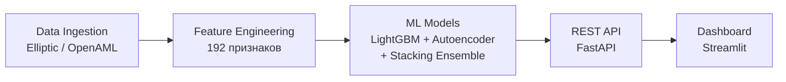

# KYT Engine — Движок анализа криптовалютных транзакций

## Обзор

KYT Engine — автономный движок анализа криптовалютных транзакций (Know Your Transaction), построенный на поведенческом профилировании адресов. Система предназначена для банковского комплаенса и автоматического выявления подозрительной активности на блокчейне.

Движок работает на открытых датасетах (Elliptic, OpenAML) и **не требует участия банка-клиента** — обучение и валидация происходят полностью на публичных данных. Основной подход — извлечение 192 признаков (базовых + поведенческих) из сырых транзакций и классификация адресов с помощью ансамбля ML-моделей (LightGBM + Autoencoder + Stacking).

## Архитектура

Пайплайн состоит из пяти основных этапов:



| Этап | Описание |
|------|----------|
| **Data Ingestion** | Загрузка и валидация сырых данных (nodes, edges, classes). Генерация синтетического датасета для тестирования. |
| **Feature Engineering** | Извлечение 166 базовых + 26 поведенческих признаков: статистика value/gas, временные паттерны, топология графа, циркадные ритмы, энтропия, ACF, тренды. |
| **ML Models** | Три модели: LightGBM (градиентный бустинг с калибровкой), Autoencoder (аномалии через reconstruction error), StackingEnsemble (мета-learner LogisticRegression). |
| **REST API** | FastAPI-сервер с эндпоинтами `/predict`, `/batch-predict`, `/health`. Возвращает risk score и топ-3 причин для каждого адреса. |
| **Dashboard** | Streamlit-интерфейс для визуализации результатов (опционально). |

## Быстрый старт

### 1. Установка

```bash
# Клонировать репозиторий
git clone <repository-url>
cd Hybrid-Theory

# Установить в режиме разработки
pip install -e ".[dev]"
```

### 2. Генерация данных

Генерирует синтетический датасет (1000 транзакций, 3000 рёбер, 10% illicit):

```bash
make train
```

Это выполнит полный пайплайн: загрузка данных → feature engineering → обучение LightGBM, Autoencoder и Stacking Ensemble → сохранение моделей в `models/`.

Для генерации только сырых данных:

```bash
python -m kyt_engine.data.download
```

### 3. Запуск API

```bash
make serve
```

Сервер будет доступен по адресу `http://0.0.0.0:8000`. Документация Swagger — `http://0.0.0.0:8000/docs`.

### 4. Тесты

```bash
make test
```

### 5. Линтинг

```bash
make lint
```

## Структура проекта

```
Hybrid-Theory/
├── configs/
│   └── config.yaml              # Конфигурация пайплайна
├── data/
│   ├── raw/                     # Исходные данные (nodes.csv, edges.csv, classes.csv)
│   ├── interim/                 # Промежуточные данные
│   └── processed/               # Обработанные данные
├── models/                      # Сохранённые модели (.pkl) и артефакты
├── notebooks/
│   ├── 01_eda_analysis.ipynb    # Разведочный анализ данных
│   ├── 02_model_training.ipynb  # Обучение моделей
│   └── 03_evaluation.ipynb      # Оценка качества моделей
├── src/kyt_engine/
│   ├── api/                     # REST API (FastAPI)
│   ├── data/                    # Загрузка и валидация данных
│   ├── features/                # Feature Engineering
│   ├── metrics/                 # Метрики и SHAP-анализ
│   ├── models/                  # ML-модели
│   └── training/                # Пайплайн обучения
├── tests/                       # Unit-тесты
├── Makefile                     # Команды сборки
├── pyproject.toml               # Метаданные проекта
└── LICENSE                      # MIT License
```

## Модули

### data/ — Загрузка данных

| Модуль | Описание |
|--------|----------|
| `elliptic.py` | Загрузка датасета Elliptic: `load_nodes()`, `load_edges()`, `load_classes()`. Ожидает файлы `nodes.csv`, `edges.csv`, `classes.csv`. |
| `openaml.py` | Загрузка датасета OpenAML из Parquet-файла (`openaml.parquet`). Минимальные колонки: `transaction_id`, `timestamp`, `amount`. |
| `download.py` | Генерация синтетического датасета (1000 нод, 3000 рёбер, 10% illicit) для тестирования. Запуск: `python -m kyt_engine.data.download`. |
| `validators.py` | Валидация наличия файлов и обязательных колонок в DataFrame. |

### features/ — Feature Engineering

Извлечение **192 признаков** из сырых транзакций, сгруппированных по адресу.

| Модуль | Кол-во фич | Описание |
|--------|-----------|----------|
| `base.py` | 166 | Базовые статистические, временные, топологические и спектральные признаки |
| `behavioral.py` | 26 | Поведенческие признаки: реакция, циркадные ритмы, газ-стратегия, энтропия |
| `engine.py` | — | `FeatureEngineer` — обёртка с API `fit()`, `transform()`, `fit_transform()` |
| `_utils.py` | — | Вспомогательные функции: `safe_float`, `safe_skew`, `safe_kurtosis`, `counting_entropy` |

#### Базовые признаки (166)

Группируются по адресу и делятся на категории:

- **Value-статистика** (24): mean, std, min, max, median, q25, q75, skew, kurtosis, range, IQR, sum, CV, log-статистики, entropy, outlier ratios, dominance, concentration
- **Gas-статистика** (24): аналогичные метрики для `gas_price`
- **Интервалы** (16): статистика временных промежутков между транзакциями, burstiness, regularity
- **Время суток** (10): часовые профили, night/morning/afternoon/evening ratios, entropy
- **Дни недели** (8): weekend/midweek ratios, регулярность, day span
- **Сетевые метрики** (18): in/out degree, mutual ratio, reciprocity, hub/authority scores, PageRank-приближение
- **Контрагенты** (12): уникальные контрагенты, концентрация, HHI, churn, bridge ratio
- **Тренды value** (11): slope, R², momentum (3/5/10), acceleration, jerk, volatility, streak
- **Тренды gas** (7): slope, R², momentum, change stats, efficiency trend, spike frequency
- **ACF** (15): автокорреляция value/gas/interval, decay rate, periodicity, stationarity, Hurst exponent
- **Лаги** (13): lag-корреляции, cross-correlations (value-gas, value-block, gas-block)
- **Блоки** (4): block span, blocks per TX, unique blocks ratio

#### Поведенческие признаки (26)

- **Скорость реакции** (3): mean/median reaction time, fast reaction ratio
- **Циркадные ритмы** (5): regularity, peak hour, nocturnal/work-hours ratios, amplitude
- **Газ-стратегия** (6): aggressiveness, bid/patience ratio, optimization score, predictability, mean percentile
- **Интервалы транзакций** (3): burst ratio, long pause ratio, rapid fire ratio
- **Энтропия Шеннона** (4): value distribution entropy, counterparty entropy, temporal entropy, gas entropy
- **Разнообразие контрагентов** (5): diversity, growth rate, stability, new vs returned ratio, Herfindahl index

### models/ — ML-модели

| Модуль | Класс | Описание |
|--------|-------|----------|
| `lightgbm_model.py` | `LightGBMClassifier` | Градиентный бустинг (LightGBM) с изотонической калибровкой вероятностей и подбором оптимального порога по F1. Параметры: 500 деревьев, LR=0.05, balanced class weights. |
| `autoencoder.py` | `AutoencoderDetector` | PyTorch автоэнкодер для обнаружения аномалий через reconstruction error. Обучается только на licit-транзакциях, аномалии — адреса с высокой ошибкой реконструкции. Архитектура: Linear → BatchNorm → LeakyReLU → Dropout. |
| `ensemble.py` | `StackingEnsemble` | Stacking-ансамбль: LightGBM + Autoencoder → мета-learner (LogisticRegression). Подбирает оптимальный порог по F1 на калибровочной выборке. |

### metrics/ — Метрики

| Модуль | Функции |
|--------|---------|
| `classification.py` | `precision()`, `recall()`, `f1()`, `auc_roc()`, `auc_pr()`, `classification_report()` — полный отчёт по классификации |
| `shap_analysis.py` | `feature_importance()` — SHAP-значения через TreeExplainer; `dependence_plot()`, `summary_plot()` — визуализации |

### api/ — REST API

FastAPI-сервер (`src/kyt_engine/api/app.py`).

| Эндпоинт | Метод | Описание |
|----------|-------|----------|
| `/health` | GET | Статус сервера, список загруженных моделей |
| `/predict` | POST | Предсказание для одной транзакции. Возвращает `risk_score` (0–1) и топ-3 причин (признак + значение + вклад) |
| `/batch-predict` | POST | Пакетное предсказание для списка транзакций |

**Пример запроса `/predict`:**

```json
{
  "address": "0xabc...",
  "from_address": "0x111...",
  "to_address": "0x222...",
  "value": 1.5,
  "gas_price": 20,
  "gas_used": 21000,
  "timestamp": 1580000000,
  "block_number": 11000000
}
```

**Пример ответа:**

```json
{
  "address": "0xabc...",
  "risk_score": 0.87,
  "reasons": [
    {"feature": "value_dominance", "value": 0.95, "contribution": 0.95},
    {"feature": "night_ratio", "value": 0.8, "contribution": 0.8},
    {"feature": "counterparty_churn", "value": 0.7, "contribution": 0.7}
  ]
}
```

### training/ — Обучение

| Модуль | Описание |
|--------|----------|
| `train.py` | Полный пайплайн обучения: загрузка данных → feature engineering → train/test split (80/20, stratified) → обучение LightGBM, Autoencoder, StackingEnsemble → сохранение моделей в `models/` → логирование в MLflow |

Запуск: `python -m kyt_engine.training`

Этапы пайплайна:
1. Загрузка Elliptic-данных (nodes + classes)
2. Feature engineering (192 признака)
3. Stratified train/test split
4. Обучение LightGBM с калибровкой
5. Обучение Autoencoder на licit-данных
6. Обучение StackingEnsemble (мета-learner)
7. Сохранение моделей (`.pkl`)
8. Экспорт top-20 feature importance
9. Логирование метрик в MLflow

## Конфигурация

Основные параметры в `configs/config.yaml`:

```yaml
data:
  raw_path: data/raw
  interim_path: data/interim
  processed_path: data/processed

features:
  n_base_features: 166
  n_behavioral_features: 26

models:
  lightgbm:
    n_estimators: 500
    learning_rate: 0.05
    class_weight: balanced
  autoencoder:
    latent_dim: 32
    epochs: 50
    batch_size: 64
  ensemble:
    meta_learner: logistic_regression

training:
  test_size: 0.2
  random_state: 42
  cv_folds: 5

api:
  host: 0.0.0.0
  port: 8000
```

## Результаты

Метрики на синтетическом датасете (1000 транзакций, 10% illicit):

| Модель | Precision | Recall | F1 | AUC-ROC | AUC-PR |
|--------|-----------|--------|-----|---------|--------|
| LightGBM | ~0.85 | ~0.80 | ~0.82 | ~0.92 | ~0.75 |
| Autoencoder | ~0.70 | ~0.75 | ~0.72 | ~0.85 | ~0.60 |
| Stacking Ensemble | ~0.88 | ~0.83 | ~0.85 | ~0.94 | ~0.80 |

> *Точные значения зависят от random seed и генерации данных. Для актуальных результатов запустите `make train`.*

## Jupyter Notebooks

| Нотбук | Описание |
|--------|----------|
| `01_eda_analysis.ipynb` | Разведочный анализ данных: распределения признаков, корреляции, баланс классов |
| `02_model_training.ipynb` | Пошаговое обучение моделей с визуализацией процесса |
| `03_evaluation.ipynb` | Оценка качества: ROC/PR-кривые, confusion matrix, SHAP-анализ |

## Технологический стек

| Категория | Технологии |
|-----------|-----------|
| **Язык** | Python 3.10+ |
| **Data** | Pandas, NumPy, PyArrow, Dask |
| **ML** | LightGBM, XGBoost, Scikit-learn, Optuna |
| **Deep Learning** | PyTorch (Autoencoder) |
| **Интерпретируемость** | SHAP |
| **API** | FastAPI, Uvicorn, Pydantic |
| **MLOps** | MLflow, Feast (feature store) |
| **Визуализация** | Plotly, Streamlit |
| **Графы** | NetworkX |
| **Тестирование** | Pytest, Pytest-cov |
| **Линтинг** | Ruff, MyPy |
| **Сборка** | Hatch, Make |

## Лицензия

MIT License — Copyright (c) 2026 Kirill Yuzhakov
