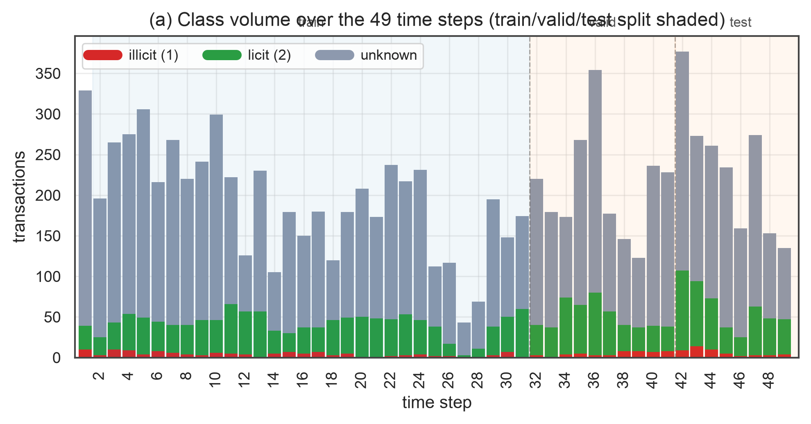
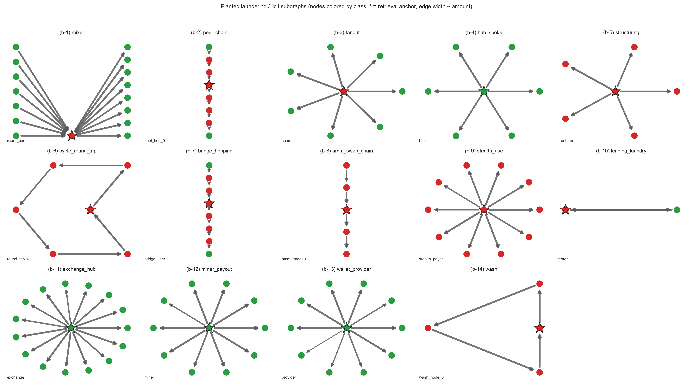
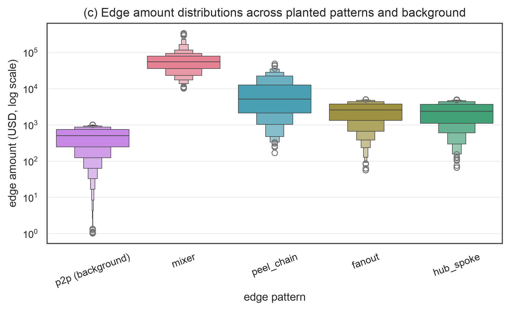
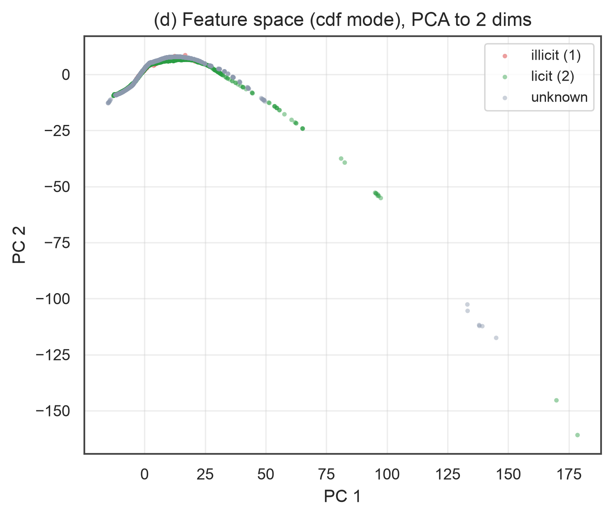
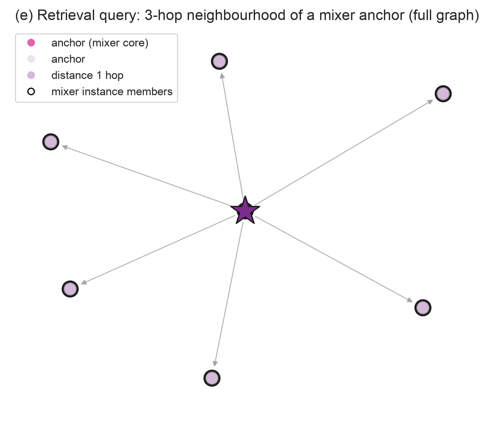

# Hybrid-Theory

Генератор синтетических криптовалютных транзакций в формате Elliptic++: по реальным статистикам блокчейн-транзакций строит вымышленный датасет, в котором заранее знаешь, что есть что. Это удобно для KYT/AML-экспериментов — поиска аномальных схем, обучения на ground truth, проверки устойчивости модели к временному дрейфу.

## Что получается на выходе

После прогона в `data/synthetic/run/` лежат четыре CSV и один JSON:

| Файл | Формат |
|------|--------|
| `elliptic_txs_features.csv` | без шапки: `txId, time_step, feat_2..feat_166` (167 колонок) |
| `elliptic_txs_classes.csv` | `txId, class`; class — строка: `1` (illicit), `2` (licit), `unknown` |
| `elliptic_txs_edgelist.csv` | `txId1, txId2` — рёбра графа транзакций |
| `elliptic_txs_edge_attributes.csv` | `txId1, txId2, amount, timestamp` — на каждое ребро сумма и время |
| `manifest.json` | конфиг, seed, sha256 всех файлов и вся «расшифровка»: какие схемы посажены, где якоря, какие суммы на рёбрах схем |

Эталонный прогон (`configs/generator.yaml`, seed 42): **10 000 tx, 14 092 ребра**. Временной сплит на привычные рубежи (train ≤30, valid 31–40, test 41–49) даёт **5856 / 2050 / 2094**; классы написаны как в настоящем Elliptic — `{'unknown', '2', '1'}`.

## Почему это выглядит правдоподобно

В `data/elliptic_stats/` лежат эмпирические распределения (квантильные сетки CDF) по каждой из 165 фич для трёх классов транзакций — их один раз снимают с настоящего Elliptic (203 769 tx) скриптом `kyt_engine._stats.compute`. Дальше генератор для каждой транзакции тянет признаки inverse-CDF-сэмплингом по её классу, так что синтетика повторяет статистику реальных данных.

**Важная оговорка.** Это режим `features.mode: cdf` — исторический профиль: он наследует анонимизацию Elliptic (фичи обезличены, семантика `feat_137` неизвестна), временно́е окно 2016–2017 и даёт только маргинальные распределения по каждой фиче по отдельности (корреляции между фичами не воспроизводятся). Для совместимости с форматом он остаётся профилем по умолчанию.

**Альтернатива — `features.mode: semantic`:** интерпретируемые фичи, которые не сэмплируются из CDF, а **вычисляются** из топологии и edge-атрибутов: in/out степени, агрегированные суммы входящих/исходящих сумм, сет-потоки, UTXO-возрасты (дельты шагов), средние таймстампы, std по суммам и т.п. Раскладка колонок фиксирована и лежит в `manifest.feature_semantics`; оставшиеся колонки (до 167-колоночного контракта) — детерминированные производные от семантического блока. В этом режиме CDF-артефакты фич не нужны (только `volume.npy` для временно́го профиля), поэтому фичи семантически осмысленны и не привязаны к окну 2016–2017 — но **не** воспроизводят распределение реального Elliptic.

## Схемы-паттерны

Посаженные подграфы с ясной семантикой — это «правильные ответы» для тестов:

- `mixer` — fan-in -> mixer_core -> fan-out (ядро illicit);
- `peel_chain` — линейная цепь, все средние узлы illicit;
- `fanout` — scam -> жертвы (scam illicit);
- `hub_spoke` — обменный хаб (licit);
- `wash` — цикл wash-trading (illicit), **дрифт-эксклюзивный**: появляется только в дрифт-режиме и только в конце временно́й шкалы;
- `p2p` — фон структурного шума (licit/unknown + остаток illicit-бюджета): случайные направленные рёбра, без гарантии связности.

Опциональные схемы современного ландшафта (включаются `n_instances > 0`; по умолчанию 0, чтобы эталонный прогон не сдвигался):

- illicit: `structuring` (smurfing под порогами), `cycle_round_trip` (возврат средств по циклу), `bridge_hopping` (кросс-чейн: вход → мост → ... → получатель), `amm_swap_chain` (последовательные свопы через пулы), `stealth_use` (stealth-платежи: illicit-оператор → `stealth_addr_*`-адреса, star-топология), `lending_laundry` (lending-as-laundering: illicit-заёмщик → licit-пулы — циклы `deposit → draw → repay → release`, пул балансируется **точно**: `sum(deposit) + sum(repay) == sum(draw) + sum(release)`);
- licit: `exchange_hub`, `miner_payout`, `wallet_provider` — лицензитные сущности с осмысленной семантикой (в отличие от фона p2p).

Поддерживаемые публичные typologies: mixer, peel chain, fanout/scam, wash-trading, structuring/smurfing, round-trip, bridge-hopping, AMM-цепочки, stealth-платежи, lending-as-laundering. Не покрыты пока: agentic-микроразбиение, pre-funding миксеров, контролируемые licit-negative (стикинг-пул/арбитраж) — см. «Ограничения».

## Пропорции (бюджеты)

`labeled_ratio` и `illicit_ratio_in_labeled` — это потолки, а не точные обязательства: схемы могут дать меньше размеченных, чем бюджет, а недобор добирается фоном. Жёстко гарантируется только одно — ровно `n_txs` транзакций.

## Retrieval-слой (включён по умолчанию)

Поверх схем строится контракт для поисковых бенчмарков:

- **Инстансы** — каждый посаженный подграф целиком: состав (`node_ids`/`edge_ids`), временное окно, точки сочленения, роли рёбер;
- **Якоря** — `per_1000_nodes` корней для запросов. С `prefer_central_anchors: true` якорь инстанса — узел с минимальным эксцентриситетом (репрезентативный «запрос», а не периферийная точка вроде `peel_hop_0`), затем жадная изоляция ≥ `min_anchor_distance` хопов в полном графе и `k_hop_neighborhoods` внутри инстанса;
- **Edge-attributes** — суммы и таймстампы рёбер с проверяемыми инвариантами: у mixer `sum(in) = sum(out) + fee`, у peel_chain сумма убывает, wash-цикл балансируется в пределах tolerance;
- **Decoys** — случайные fan_in/cycle-мотивы фона помечаются как «поисковый шум» (только аннотация, граф не трогается);
- **Holdout** — `entries: [{pattern, step_min, step_max, train_excluded}]` — разметка инстансов, попавших в нужное временное окно.

Суммы рёбер считаются своим отдельным RNG-потоком (`sha256(f"{seed}:attrs")`), поэтому эталонные числа выше от этого слоя не меняются, а выбор якорей и разметка полностью детерминированы.

## Temporal drift (опция)

`drift.enabled: true` имитирует знакомый по Elliptic эффект — «закрытие» крупного illicit-флоу и появление новых схем в хвосте:

- `shutdown_step` (рекомендуется 40) — с этого шага старые illicit-схемы подавляются; `shutdown_rate_multiplier` — доля выживающих (0.0 — жёсткое закрытие, 1.0 — ничего не умирает, промежуточные значения — постепенное затухание);
- `novel_step` (рекомендуется 45) + `novel_schemes: [wash]` — новые схемы на шагах 45–49. Список может содержать несколько паттернов сразу (`[wash, cycle_round_trip]`) — это множественный дрифт, проверка, обобщится ли модель на сразу несколько невиданных схем; `scenario` — произвольная метка сценария (`multi_novel`, `gradual_decay`, …).

Проверенный сценарий: `shutdown_step: 40`, `shutdown_rate_multiplier: 0.0`, `novel_step: 45` — novel-схемы строго на 45–49, старый illicit только до шага 40.

## Ограничения

Проект — инструмент для **контролируемых** экспериментов retrieval + GBDT (в духе Spillety), а не замена реальных размеченных данных. Что он не делает:

- **`cdf`-режим наследует пороки Elliptic**: анонимизацию фич и окно 2016–2017; «генерация» в этом режиме — во многом ресэмплинг маргиналов Elliptic с известным заранее ground truth. Joint-распределения (корреляции между фичами) не контролируются;
- **Худшие честные числа**: на суррогатной валидации (полный 165-мерный отчёт в `cdf`-режиме и структурное подпространство) синтетика пока заметно дальше от реальных данных, чем own-split-шум — correlation gap в 10× больше базы в `cdf`-пространстве, а transfer-F1 на реальном тесте невысок. Это ожидаемо: маргиналы-копии Elliptic не дают ни корреляций, ни перфорации «из коробки»; отчёт честно это показывает;
- **`p2p` фон — структурный шум**, а не семантический licit: «licit» не означает «реальная биржа», поэтому модель может выучить «licit = случайные рёбра»; явные licit-схемы (`exchange_hub`, `miner_payout`, `wallet_provider`) нужно включать вручную;
- **Decoys** — детектированные случайные мотивы фона, а не контролируемые негативные примеры (стикинг-пул, DEX-арбитраж). Такие licit-negative пока не генерируются;
- **Downstream-валидация — суррогат**, не proof: RF на структурном подпространстве решает упрощённую задачу, а честные пороги (`≤ 0.05` gap) ещё не калибровались на бОльшей сетке конфигов;
- **Покрытые схемы** — классические (mixer, peel, fanout, wash, structuring, round-trip, bridge-hopping, AMM-цепочки) + stealth-платежи и lending-as-laundering; agentic-микроразбиение, pre-funding и контролируемые licit-negative ещё не реализованы;
- **`semantic`-режим** осмысленен, но его производные колонки (24..164) не соответствуют распределению Elliptic — их нельзя использовать для оценки «похожести» на реальные данные.

Реалистичные следующие шаги: copula/VAE-фичи с joint-валидацией, калибровка честного порога transfer-gap, контролируемые decoys и few-shot transfer на больших конфиг-сетках.

## Визуализация датасета

Фигуры 1, 3, 4 и 5 снимаются с эталонного прогона (`configs/generator.yaml`, seed 42), **Рис. 2** — топологии посаженных подграфов — рисуется из отдельного конфига в памяти, где включён весь набор схем (классические, современные laundering-паттерны, stealth-платежи, lending-as-laundering и licit-сущности; `wash` появляется только в хвосте временной шкалы, как и положено дрифту). Скрипт: `scripts/make_figures.py` (seaborn + matplotlib + networkx; `pip install seaborn networkx` → `python scripts/make_figures.py`).



*Рис. 1. Объём транзакций по классам на 49 шагах времени. Сплит train ≤30 / valid 31–40 / test 41–49 затенён.*



*Рис. 2. Посаженные подграфы-схемы: цвет узла — класс (красный — illicit, зелёный — licit), звезда — retrieval-якорь, толщина ребра ~ лог-сумма; подпись в углу панели — роль ключевого узла.*



*Рис. 3. Распределение сумм рёбер по типам схем (логарифмическая шкала). Mixer-якоря и hub/spoke резко крупнее фонового p2p.*



*Рис. 4. Признаковое пространство cdf-режима (165 фич → PCA, 2 компоненты). Классы разделяются, но воспроизводят лишь маргиналы Elliptic.*



*Рис. 5. Retrieval-запрос в полном графе: 3-хоповое окружение якоря mixer_core (звёздочка). Чёрный контур — узлы инстанса mixer; градиент — расстояние от якоря.*

## Быстрый старт

```bash
python3 -m venv .venv && source .venv/bin/activate
pip install -e ".[dev]"

# 1. Снять статистики с настоящего Elliptic (data/raw/elliptic_txs_features.csv, ~690 МБ)
python -m kyt_engine._stats.compute

# 2. Сгенерировать датасет (configs/generator.yaml — cdf-режим фич)
python -m kyt_engine.synth generate --config configs/generator.yaml

#    Семантический режим фич:
#    features.mode: semantic  ->  python -m kyt_engine.synth generate --config ...

# 3. Проверить, что датасет собран по контракту
python -m kyt_engine.synth validate --dir data/synthetic/run

# 4. Валидация качества против настоящего Elliptic (нужны data/raw/elliptic_txs_*.csv):
#    --mmd        -> distribution_report.json  (MMD², copula, correlation gap)
#    --downstream -> downstream_report.json    (RF-трансфер на held-out Elliptic)
python -m kyt_engine.synth validate --dir data/synthetic/run --raw-dir data/raw --mmd --downstream
```

Детерминизм: одинаковый `seed` + одинаковый конфиг -> байт-в-байт одинаковые файлы (включая manifest).

## Структура

```
Hybrid-Theory/
├── .agents/skills/SKILL.md           # навигационный SKILL по проекту
├── configs/generator.yaml          # параметры: размеры, схемы, фичи, дрифт, retrieval
├── scripts/make_figures.py         # сборка научных визуализаций датасета
├── artifacts/figures/              # PNG-фигуры, встроенные в README
├── data/
│   ├── raw/                        # Elliptic (gitignored, источник статистик)
│   └── elliptic_stats/             # CDF-артефакты (создаёт compute)
├── src/kyt_engine/
│   ├── _stats/compute.py           # разовое снятие статистик с Elliptic
│   └── synth/
│       ├── config.py               # GeneratorConfig (yaml), фичи/дрифт/якоря
│       ├── stats.py                # загрузка CDF, sample_features (inverse-CDF+jitter)
│       ├── schemes.py              # шаблоны схем (классические + современные + licit)
│       ├── graph.py                # сборка графа, шагов, дрифта, SchemeRun (границы инстансов)
│       ├── anchors.py              # инстансы, edge-атрибуты, якоря, K-hop, decoy, holdout
│       ├── features.py             # фиче-матрица (cdf-режим) по классам
│       ├── features_semantic.py    # фиче-матрица (semantic-режим): из топологии/атрибутов
│       ├── features_structural.py  # общее 7-колоночное структурное подпространство (синт. + raw)
│       ├── distribution.py         # MMD²/copula/correlation-gap против raw Elliptic
│       ├── downstream.py           # RF-трансфер: F1/PR-AUC/ECE на held-out реальном тесте
│       ├── emit.py                 # 4 CSV + manifest.json (sha256, ground truth, retrieval)
│       ├── validate.py             # контракт-валидатор + семантическая сверка
│       └── __main__.py             # CLI: generate | validate (--mmd/--downstream/--raw-dir)
└── tests/test_synth.py
```

## Тесты

```bash
make test   # pytest tests/
make lint   # ruff check + format --check
```

## Лицензия

GNU AGPL — Copyright (c) 2026 Kirill Yuzhakov.
