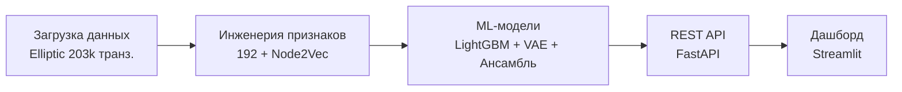

# Hybrid Theory (KYT Engine)

Движок анализа криптовалютных транзакций для банковского AML-комплаенса.

Обчуен на <написать>. Извлекает <написать> признаков. Классифицирует транзакции ансамблем LightGBM + VAE + Stacking. На иснфраструктуре <написать>.

Основная идея <написать>. 

## Результаты

| Модель | Precision | Recall (illicit) | F1 | AUC-ROC | AUC-PR | Eval set |
|--------|-----------|------------------|----|---------|--------|----------|
| LightGBM | 0.977 | 0.999 | 0.988 | 0.955 | 0.995 | val (t=37-44) |
| Autoencoder | 0.925 | 1.000 | 0.961 | 0.561 | 0.933 | val (t=37-44) |
| Ensemble | 0.968 | 0.999 | 0.983 | 0.858 | 0.995 | test (t=45-49) |


## Архитектура

<переписать на объяснение как краулятся данные, где датасеты, где iceberg, bigquery и тд - как на собеседовании по system design>


## Быстрый старт

```bash
python3 -m venv .venv && source .venv/bin/activate
pip install -e ".[dev]"

python -m kyt_engine.training.train_real

# http://0.0.0.0:8000
make serve
```

## Структура

```
Hybrid-Theory/
├── configs/config.yaml
├── data/raw/                    # Elliptic 
├ docs/                        
│   ├── README.md                
│   ├── methodology.md           
│   ├── results.md               
│   └── figures/                 # графики
├── models/                      
├── notebooks/                   # Jupyter (EDA, обучение, оценка)
├── src/kyt_engine/
│   ├── data/                    # загрузчики данных
│   ├── features/                # инженерия признаков + Node2Vec
│   ├── metrics/                 # метрики + SHAP
│   ├── models/                  # LightGBM, Autoencoder, VAE
│   ├── training/                
│   └── api/                     
└── tests/                       
```

## Стек

Python 3.10+ | LightGBM | PyTorch (VAE) | NetworkX + Node2Vec | FastAPI | Matplotlib + Seaborn | Pytest

## Лицензия

GNU Affero General Public License — Copyright (c) 2026 Kirill Yuzhakov
