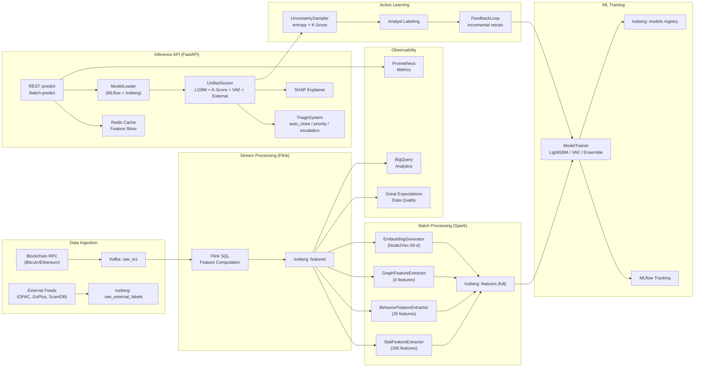

# Hybrid Theory (KYT Engine)

Движок анализа криптовалютных транзакций для банковского AML-комплаенса.

Обучен на датасете **Elliptic Bitcoin** (203,769 транзакций, 46,564 размеченных). Извлекает 191 признак (165 статистических + 26 поведенческих) + графовые эмбеддинги. Классифицирует транзакции ансамблем LightGBM + K-Score + VAE + External Labels. На инфраструктуре **Iceberg + Kafka + Flink + Spark + Redis**.

Основная идея — **многоуровневый конвейер**: real-time ingestion (RPC → Kafka → Flink) → distributed feature extraction (Spark) → multi-model ensemble scoring (Unified Scorer) → triage-based case management → active learning feedback loop.

## Результаты

| Модель | Precision | Recall (illicit) | F1 | AUC-ROC | AUC-PR | Eval set |
|--------|-----------|------------------|----|---------|--------|----------|
| LightGBM | 0.977 | 0.999 | 0.988 | 0.9549 | 0.9953 | val (t=37-44) |
| Autoencoder | 0.925 | 1.000 | 0.961 | 0.5609 | 0.9331 | val (t=37-44) |
| Stacking Ensemble | 0.968 | 0.999 | 0.983 | 0.8583 | 0.9946 | test (t=45-49) |
| **Unified Scorer** | — | — | — | — | — | **production** |
| **K-Score** | — | — | — | — | — | mean=0.162, GREEN=41,434, YELLOW=4,987, RED=143 |
| **Triage** | — | — | — | — | — | **99.7% Priority, 0.3% Escalation** |


## Архитектура



## Data Lakehouse

Промышленная версия KYT Engine построена на data lakehouse-архитектуре с Apache Iceberg в качестве unified storage layer. Lakehouse сочетает гибкость data lake (произвольные форматы, schema-on-read) с транзакционными гарантиями data warehouse (ACID, time-travel, schema evolution).

**Ключевые Iceberg-таблицы:**

| Таблица | Партиция | Назначение |
|---------|----------|-----------|
| `raw_txs` | days(timestamp) | Сырые блокчейн-транзакции из Kafka + исторические CSV |
| `raw_external_labels` | days(timestamp) | OFAC/GoPlus/ScamDB лейблы с confidence scoring |
| `features` | days(timestamp) | Полный набор из 196 признаков (166 stat + 26 behavior + 4 graph + 64-d embedding) |
| `predictions` | days(timestamp) | Результаты Unified Scorer с risk_score, risk_zone, triage_level, SHAP |
| `models` | — | Версионированный реестр моделей с метриками и snapshot-ID обучающих данных |

**Преимущества lakehouse-подхода:**

- **ACID-транзакции:** атомарные коммиты предотвращают чтение частично обогащённых features
- **Time-travel:** воспроизведение предсказаний на конкретный момент времени для аудита
- **Schema evolution:** добавление колонок (stat_feat_167, embedding_65) без миграции
- **Partition evolution:** смена стратегии партиционирования без перезаписи данных
- **Hidden partitioning:** партиция по дням, прозрачная для пользователя

## Быстрый старт

```bash
python3 -m venv .venv && source .venv/bin/activate
pip install -e ".[dev]"

# Обучение на реальных данных Elliptic
python -m kyt_engine.training.train_real

# Запуск API
make serve
# http://0.0.0.0:8000
```

## Структура

```
Hybrid-Theory/
├── configs/config.yaml
├── data/
│   ├── raw/                    # Elliptic CSV
│   └── external/               # OFAC, GoPlus, ScamDB cache
├── docs/                        
│   ├── README.md                # Detailed documentation
│   ├── methodology.md           # Technical methodology
│   ├── results.md               # Evaluation results
│   └── figures/                 # Graphs
├── models/                      # Serialized models (.pkl)
├── notebooks/                   # Jupyter (EDA, training, evaluation)
├── src/kyt_engine/
│   ├── data/                    # Loaders, scrapers, Iceberg store
│   ├── features/                # Feature engineering + Spark extractors
│   ├── ingestion/               # Kafka producer, Flink job
│   ├── metrics/                 # Metrics + SHAP
│   ├── models/                  # LightGBM, Autoencoder, K-Score, Triage, UnifiedScorer
│   ├── training/                # train_real, active_learning
│   └── api/                     # FastAPI inference service
└── tests/                       
```

## Стек

Python 3.10+ | LightGBM | PyTorch (VAE) | NetworkX + Node2Vec | FastAPI | Redis | Kafka | Flink | Spark | Iceberg | MLflow | Prometheus | Pytest

## Лицензия

GNU Affero General Public License — Copyright (c) 2026 Kirill Yuzhakov