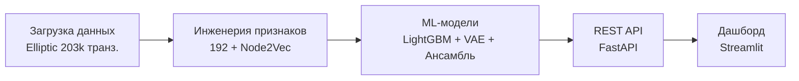

# Hybrid Theory (KYT Engine)

Движок анализа криптовалютных транзакций для банковского AML-комплаенса.

## Обзор

KYT Engine — автономный движок Know Your Transaction, обученный на открытом датасете **Elliptic** (203,769 Bitcoin-транзакций, 46,564 размеченных). Извлекает **260 признаков** (166 базовых + 26 поведенческих + 4 графовых + 64 Node2Vec эмбеддинга) и классифицирует транзакции ансамблем LightGBM + VAE + Stacking.


### Ключевые метрики (temporal split, честная оценка)

| Модель | Precision | Recall (illicit) | F1 | AUC-ROC | AUC-PR | Eval set |
|--------|-----------|-------------------|-----|---------|--------|----------|
| **LightGBM** | 0.977 | 0.999 | 0.988 | 0.955 | 0.995 | val (t=37-44) |
| **Autoencoder** | 0.925 | 1.000 | 0.961 | 0.561 | 0.933 | val (t=37-44) |
| **Ensemble** | 0.968 | 0.999 | 0.983 | 0.858 | 0.995 | test (t=45-49) |

## Результаты


## Архитектура



| Этап | Описание |
|------|----------|
| **Загрузка данных** | Elliptic: 203k транз., 234k рёбер, 49 временных шагов |
| **Инженерия признаков** | 166 базовых + 26 поведенческих + 4 графовых + 64 Node2Vec = 260 |
| **ML-модели** | LightGBM (градиентный бустинг), VAE (обнаружение аномалий), StackingEnsemble |
| **REST API** | `/predict`, `/batch-predict`, `/health`. Скор риска + топ-3 причины |

## Быстрый старт

```bash
python3 -m venv .venv && source .venv/bin/activate
pip install -e ".[dev]"

# Обучение на реальных данных (~35 сек)
python -m kyt_engine.training.train_real

# Тесты
make test  

# API http://0.0.0.0:8000
make serve
```

## Источники

| Источник | Тип | Ключевой вклад |
|----------|-----|----------------|
| **Elliptic** (Kaggle) | Датасет | 203k Bitcoin транз., 166 признаков |
| **Elliptic++** (KDD 2023) | Датасет | 822k адресов, метки адресов |
| **HNN4RP** (JEIT 2025) | Метод | Гетерогенная GNN + RWR для rug pull |
| **MPOCryptoML** (arXiv 2025) | Метод | Multi-pattern PPR для AML-структур |
| **PTXPHISH** (NDSS 2025) | Метод+Датасет | Payload-фишинг, 5k транз. |
| **StableAML** (arXiv 2026) | Метод | Tree-based > GNN для стейблкоинов |
| **FlowShield** (arXiv 2026) | Метод | F1=98%, LLM+GCN fusion |
| **HyPV-LEAD** (IEEE 2025) | Метод | Гиперболические эмбеддинги, PR-AUC 0.9624 |

Полный обзор: `K-BRAIN/ChangeLog/sources-review.md`

## Структура

```
Hybrid-Theory/
├── configs/config.yaml
├── data/raw/                    # Elliptic (203k транз.)
├ docs/                        # Академическая документация
│   ├── README.md                # Полная статья с рисунками
│   ├── methodology.md           # Детали методологии
│   ├── results.md               # Анализ результатов
│   └── figures/                 # 8 публикационных графиков
├── models/                      # Сохранённые модели (.pkl)
├── notebooks/                   # Jupyter (EDA, обучение, оценка)
├── src/kyt_engine/
│   ├── data/                    # Загрузчики данных
│   ├── features/                # Инженерия признаков + Node2Vec
│   ├── metrics/                 # Метрики + SHAP
│   ├── models/                  # LightGBM, Autoencoder, VAE, Ансамбль
│   ├── training/                # train_real.py, demo_incremental.py
│   └── api/                     # FastAPI
├── tests/                       # 23 теста
└── K-BRAIN/                     # База знаний
```

## Стек

Python 3.10+ | LightGBM | PyTorch (VAE) | NetworkX + Node2Vec | FastAPI | Matplotlib + Seaborn | Pytest

## Лицензия

GNU Affero General Public License — Copyright (c) 2026 Kirill Yuzhakov
