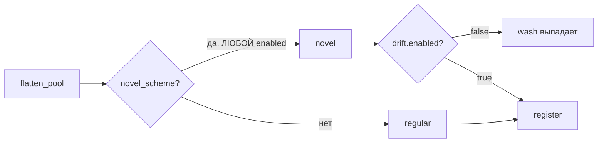

# 03 Subagent — ai-slops и «написанное нейросетью» (код-ревью генератора)

Отчёт subagent-3 (агент-ревьюер по `K-BRAIN/SKILLS/ai-slops.md` + `code-review.md`). Полный разбор; здесь пункты по приоритету.

## 🔴 Critical

1. **`wash` молча выпадает из дефолтного конфига** — `graph.py:62` исключает `novel_scheme` из `regular` безусловно, а novel-проход (`graph.py:108-112`) гейтится `if drift.enabled`. При `drift.enabled: false` (дефолт `generator.yaml:35`) wash (заявлен `n_instances: 10`) не генерируется вовсе. Проверено: wash nodes = 0. Почему «нейросеть»: фильтр «под будущее гейта» не согласован со вторым потребителем — типичная генеративная невнимательность. Тест `test_schemes_restored_from_manifest` (`tests:87`) проверяет только `{mixer, fanout}` — пропустил.
2. **Дрифт утекает офсетом шагов (11/30 сидов)** — `graph.py:99` режет по `birth >= shutdown_step`, но фактический шаг = `birth + offset(0..2)` (`graph.py:89-91`). При `multiplier=0.0` illicit вылезает на 35-36. Фикс: гейт по скорректированному шагу.
3. **`test_deterministic` — тавтология** — `tests:63-72`: оба конфига пишут в один `out_dir` (`tests:38` `tmp_path/"run"`), `df1`/`df2` читают один и тот же файл. Детерминизм не проверяется вообще.
4. **Сломанная ветка отрицательного `n_bg_unknown`** — `graph.py:119-122` не соответствует комментарию, арность `bg_pool` не сходится, состав молча усекается `range(n_bg)`. Мёртвая ветка от генератора.
5. **Краш при переборе схем** — `graph.py:115`: если схемы дают ≥ n_txs узлов, `n_bg < 0` → `np.full` → ValueError. Нет `max(0, …)`.
6. **Конфиг обещает пропорции, код не держит** — schemes добавляются до бюджета и после пересечения (`graph.py:104`), novel-проход без бюджета, licit-узлы схем не ограничены. Проверено: при `n_instances=50` у hub_spoke labeled=0.281 при конфиге 0.23 (в крайнем случае 0.793 при 0.30). Ни постпроверки, ни ассерта.
7. **Тройное дублирование дефолтов** — `config.py:11-29` vs `:33-51` vs `:53-68`; `to_dict` не пишет `out_dir` → манифест неполон для репродукции.
8. **Мёртвый код**: `LABEL_TO_CLASS` ×2 (`stats.py:13`, `graph.py:12`), `CLASS_TO_SOURCE` (`stats.py:12`), `step_weight()` (`stats.py:43-44`), `STEP_MAX` в stats.
9. **Один словарь ×3**: `stats.py:12`, `compute.py:14`, `emit.py:44`.
10. **Комментарий «гарантируют связность» лжёт** — `generator.yaml:30`, `graph.py:146-153`: p2p-рёбра `rng.choice` с возвратом, self-loop дропаются, дубликаты остаются, схемы не соединены с фоном (0 рёбер между ними).
11. **Дубли констант по файлам**: `STEP_MIN/MAX` ×2, литерал `2+165` в `features.py:14` (без импорта `N_FEATURES`), `49` в тест-фикстуре, `("illicit","licit","unknown")` в `features.py:18`.
12. **`_assemble_rng` — прослойка ради прослойки** (`graph.py:36-37`), а в `__main__.py:23-24` второй `default_rng` инлайн — два стиля одного и того же.
13. **`_register`: мёртвая первая запись step + слайс-«угадайка»** — `graph.py:81,89-91`, итератор назван `_tx`, хотя мутируется.
14. **`np.empty` в compute** — `compute.py:40`: `np.quantile` от неинициализированной памяти → мусорные CDF при пустом классе.
15. **Docstring-вода**: `schemes.py:16`, `validate.py:9-15` (пересказ ассертов), `features.py:12` («по классу роли» — фактически по `nd.cls`, неверно).
16. **Комментарии-пересказы**: `graph.py:60-61,124,146`, `emit.py:39`, `tests:85` («все схемы» — а ассерт на `{mixer,fanout}`).
17. **`stats_dir_path` — прослойка** (`tests:113-114`), дублирует путь из фикстуры.
18. **`fanout` и `hub_spoke` — клоны** (`schemes.py:60-75`), отличаются ролью/классом; один параметризованный билдер.
19. **`validate_dataset` на `assert`** — проходит при `python -O`; «контракт» должен бросать явные исключения; плюс тавтологичный ассерт `[:2]==[txId,time_step]` (назначено строкой выше); плюс `load_elliptic` читает CSV повторно после `validate_dataset`.
20. **Повторное чтение файлов в `load_elliptic`** — `validate.py:44-52`.
21. **Лишний параметр `rng_seed`** — `emit.py:27`, `config` уже несёт `.seed`.
22. **Рассинхрон README ↔ код**: «peel_chain illicit hop» (в коде все средние узлы illicit), «p2p фон licit/unknown» (в коде есть illicit), edgelist «вход→выход» (p2p случайные), «Elliptic+» в emit vs «Elliptic++» в README.

## 🟡 Suggestions
- `schemes.py:23-29` — хелперы на грани «прослоек».
- `__main__.py:18` — sentinel только по `cdf_illicit.npy`.
- `compute.py:8` — константы датасета живут в `synth.stats`, а не в нейтральном модуле; обратная зависимость `_stats → synth`.
- `generator.yaml:36-39` — дефолты дрифта продублированы из `DriftConfig`.
- `graph.py:62-63` — `_flatten_pool` считается дважды.
- `tests:76` — `import json` в теле.

## ✅ Good Practices
- **Manifest с sha256 + ground_truth** — реально ценное решение для бенчмарков; тест восстановления схем по делу.
- **inverse-CDF + джиттер** (`stats.py:28-37`) — корректный и простой реализм.
- **Чанкованное чтение 690 МБ** в `compute.py:27`.
- Детерминизм на ровном сидинге; формат CSV повторяет контракт Spillety.
- Тонкое разделение: схемы/статистики/граф/эмиссия.