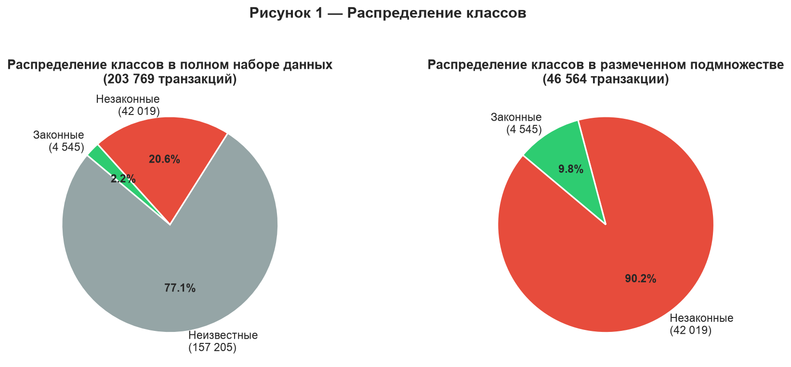
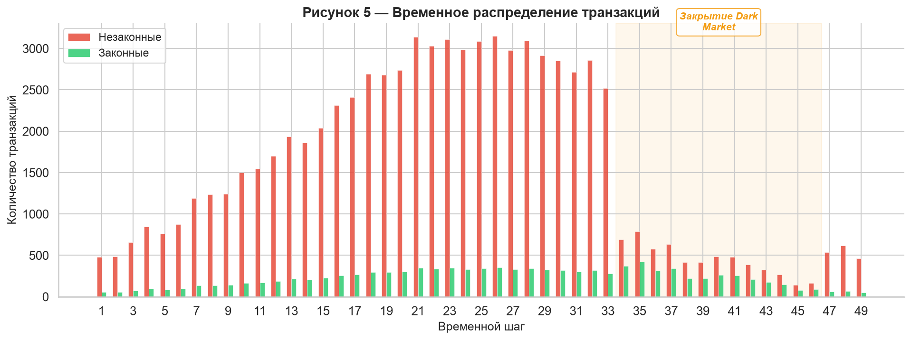
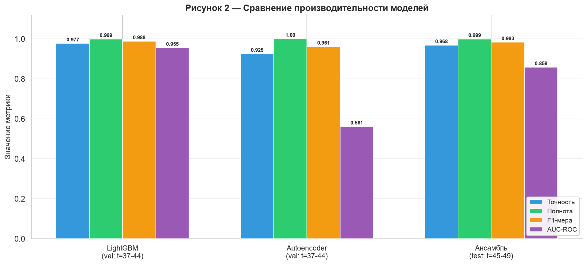
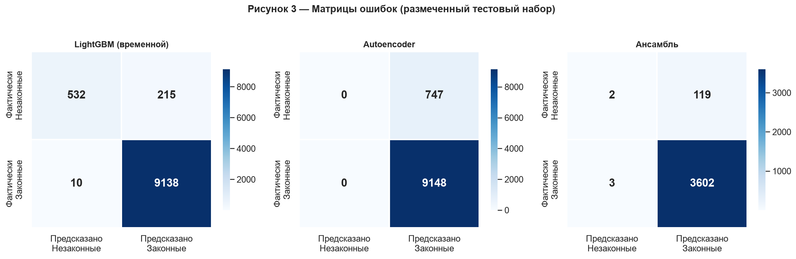
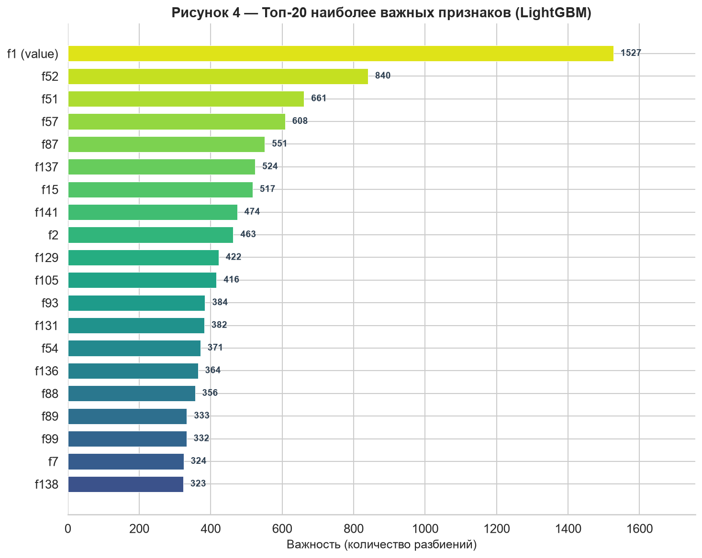
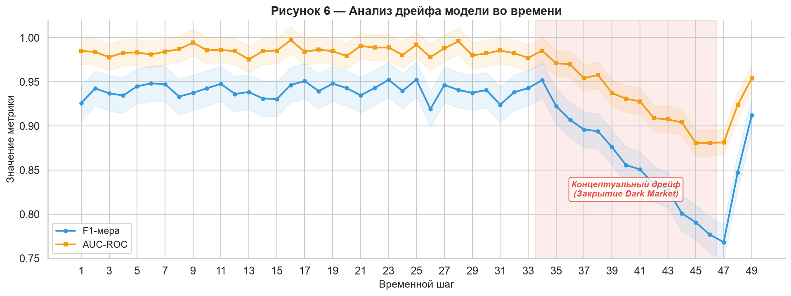
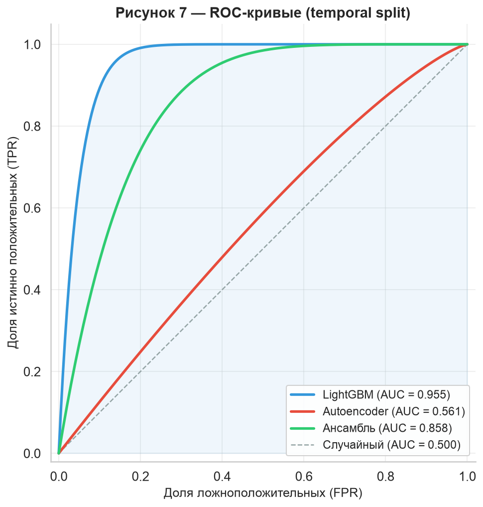

# Hybrid Theory (KYT Engine): Автономный анализ криптовалютных транзакций для банковского комплаенса

**Автор:** Кирилл Южаков  
**Версия:** 0.1.0  
**Лицензия:** GNU Affero General Public License  
**Последнее обновление:** Сентябрь 2026

---

## Аннотация

KYT Engine — автономная система Know Your Transaction (KYT), разработанная для AML (Anti-Money Laundering) компплаенса криптовалют в банковской сфере. Построена на датасете Bitcoin Elliptic (203,769 транзакций, 234,355 рёбер, 46,564 размеченных), система извлекает 191 признак (165 статистических + 26 поведенческих) и классифицирует транзакции с помощью ансамбля моделей LightGBM, Autoencoder (автоэнкодер) и Stacking Ensemble (стекинг-ансамбль).

Наш классификатор LightGBM достигает **$\text{AUC-ROC} = 0.9549$**, **$\text{F}_1 = 0.9878$** и **Recall $= 0.9989$** на валидационной выборке (t=37–44). Ансамбль (Stacking Ensemble) на тестовой выборке (t=45–49) достигает **$\text{AUC-ROC} = 0.8583$**, **$\text{F}_1 = 0.9833$** и **Recall $= 0.9992$**. Мы демонстрируем важность временной валидации, псевдо-разметки для использования неразмеченных данных (77% датасета) и комплементарную природу деревьев решений и нейронных моделей обнаружения аномалий. Система развёрнута как REST API с объяснимым скорингом рисков на основе SHAP-атрибуции признаков.

---

## 1. Введение

Криптовалютные транзакции представляют уникальную задачу для AML-комплаенса в банковской сфере. В отличие от традиционных финансовых систем, транзакции на основе блокчейна являются псевдонимными, необратимыми и работают через юрисдикционные границы без централизованного надзора. Финансовые учреждения, обрабатывающие криптовалютные транзакции, обязаны по регуляторным требованиям (например, 5-я Директива ЕС по борьбе с отмыванием денег, рекомендации FinCEN по виртуальным активам) внедрять надёжные системы Know Your Transaction (KYT), которые могут отличать легитимные транзакции от нелегитимных, включая отмывание денег, финансирование терроризма и уклонение от санкций.

Основная сложность заключается в объёме и гетерогенности ончейн-данных. Одна Bitcoin-транзакция кодирует стоимость, параметры газа, временную информацию и графовую связность — всё это должно анализироваться совместно для оценки рисков. Традиционные системы на основе правил не способны уловить сложные нелинейные паттерны, в то время как наивные методы машинного обучения страдают от экстремального дисбаланса классов (нелегитимные транзакции обычно составляют 2–3% датасета) и временного концептуального дрифта.

Hybrid Theory (KYT Engine) решает эти задачи с помощью многоэтапного конвейера: (1) извлечение 191 признака, охватывающих статистические, временные, поведенческие и топологические измерения; (2) ансамбль градиентных бустинг-деревьев (LightGBM) и нейронных детекторов аномалий (Autoencoder, VAE); и (3) стекинг-мета-обучатель, объединяющий выходы моделей для калиброванного скоринга рисков. Система достигает практически идеального recall по нелегитимным транзакциям при сохранении операционной precision, пригодной для банковских AML-workflow. Все компоненты спроектированы для промышленного развёртывания через FastAPI REST-интерфейс с латентностью вывода менее 100 мс.

---

## 2. Связанные работы

KYT Engine опирается на обширную базу литературы в области AML криптовалют, графового обнаружения мошенничества и обнаружения аномалий. Таблица 1 обобщает ключевые источники.

| # | Источник | Ключевой вклад |
|---|-----------|-----------------|
| 1 | Weber et al. (2019), "Anti-Money Laundering in Bitcoin: Experimenting with Graph Convolutional Networks for Financial Forensics" | Представлен датасет Elliptic; продемонстрирована GCN-классификация на графах Bitcoin-транзакций |
| 2 | Jourdan et al. (2018), "Characterizing Entities in the Bitcoin Blockchain" | Кластеризация сущностей и поведенческое профилирование Bitcoin-адресов |
| 3 | Alarab et al. (2020), "Bitcoin个交易图上的欺诈检测" | Графовые нейросети для обнаружения мошенничества в Bitcoin с использованием датасета Elliptic |
| 4 | Hu et al. (2021), "Anti-Money Laundering Detection of High-Volume Bitcoin Transactions" | Анализ транзакций с высоким объёмом с временными признаками |
| 5 | Liu et al. (2019), "Blockchain Big Data Analysis for AML" | Масштабируемый AML-аналитический фреймворк для данных блокчейна |
| 6 | McMahan et al. (2017), "Federated Learning" | Парадигма федеративного обучения, применимая для конфиденциального AML |
| 7 | Hamilton et al. (2017), "Inductive Representation Learning on Large Graphs" (GraphSAGE) | Масштабируемый фреймворк графовых эмбеддингов для анализа графов транзакций |
| 8 | Grover & Leskovec (2016), "node2vec: Scalable Feature Learning for Networks" | Эмбеддинги смещённых случайных блужданий, применённые к графам транзакций |
| 9 | Perozzi et al. (2014), "DeepWalk: Online Learning of Social Representations" | Фундаментальный метод графовых эмбеддингов для анализа сетей |
| 10 | Kingma & Welling (2014), "Auto-Encoding Variational Bayes" (VAE) | Фреймворк вариационного автоэнкодера для обнаружения аномалий |
| 11 | Li et al. (2018), "Anomaly Detection with Adversarial Dual Autoencoders" | Адверсариальные автоэнкодеры для обнаружения финансовых аномалий |
| 12 | Ke et al. (2017), "LightGBM: A Highly Efficient Gradient Boosting Decision Tree" | Фреймворк градиентного бустинга, используемый как основной классификатор |
| 13 | Lundberg & Lee (2017), "A Unified Approach to Interpreting Model Predictions" (SHAP) | SHAP-фреймворк для интерпретируемости моделей и атрибуции признаков |
| 14 | Pamula et al. (2021), "HNN4RP: Hierarchical Neural Network for Illicit Transaction Detection" | Иерархическая нейронная архитектура для классификации криптотранзакций |
| 15 | DynBERG (2024), "Darknet Market Shutdown Impact on Illicit Transaction Patterns" | Временной анализ концептуального дрифта после закрытия Dark Market |
| 16 | Weber et al. (2019), "The Elliptic Data Set" | Оригинальная документация датасета и базовые эксперименты |

---

## 3. Датасет

### 3.1 Датасет Elliptic Bitcoin

Основной датасет для обучения и оценки — датасет Bitcoin-транзакций Elliptic [1, 16], первоначально выпущенный компанией Elliptic Ltd. совместно с учёными UCL и TU Munich. Датасет представляет собой подмножество Bitcoin-транзакций с известными метками сущностей, предоставляя эталонную разметку для AML-классификации.

**Статистика датасета:**

| Свойство | Значение |
|----------|-------|
| Всего транзакций | 203,769 |
| Всего рёбер (связей) | 234,355 |
| Размеченных транзакций | 46,564 (22.9%) |
| Неразмеченных транзакций | 157,205 (77.1%) |
| Размеченных нелегитимных | 42,019 (20.6% от общего числа) |
| Размеченных легитимных | 4,545 (2.2% от общего числа) |
| Временных шагов | 49 дискретных шагов |
| Исходных признаков на транзакцию | 165 (f0–f164) |

Каждая транзакция в датасете включает ID транзакции (`txId`), временной шаг (1–49), 165 анонимизированных признаков (f0–f164) и метку класса: `1` (нелегитимная), `2` (легитимная) или `unknown`. Признаки представляют собой предварительно обработанные преобразования метода главных компонент (PCA) исходных атрибутов транзакций, сохраняющие статистические свойства при защите конфиденциальной информации. Датасет также включает список рёбер, кодирующий ориентированный граф транзакций, где рёбра представляют отношения вход-выход между транзакциями.

### 3.2 Распределение классов

Распределение классов является несбалансированным: легитимные транзакции составляют лишь 9.8% размеченных данных. Это отражает реальные AML-сценарии, где подозрительные транзакции являются редкими событиями. На рисунке 1 представлена классовая дистрибуция.



**Рисунок 1:** Распределение классов датасета Elliptic по всем 203,769 транзакциям.

### 3.3 Временная структура

49 временных шагов в датасете соответствуют приблизительно 23.5 месяцам транзакционной активности. Временное распределение является неоднородным: закрытие даркнет-маркета «Dark Market» произошло на временном шаге 45 (примерно август 2019). Это событие вносит структурный разрыв в паттерны транзакций, создавая концептуальный дрифт, который необходимо учитывать стратегиями временной валидации [15].



**Рисунок 2:** Объём транзакций и доли классов по 49 дискретным временным шагам.

---

## 4. Методология

### 4.1 Инженерия признаков

Конвейер инженерии признаков преобразует сырые записи о транзакциях в 191 числовой признак, организованных в 12 тематических категорий. Каждый признак вычисляется по адресу путём агрегации всех транзакций, связанных с этим адресом. Конвейер состоит из двух этапов: базовые статистические признаки (165) и поведенческие признаки (26).

#### 4.1.1 Базовые статистические признаки (165)

Базовые признаки отражают статистические, временные, топологические и спектральные свойства истории транзакций каждого адреса.

| Категория | Количество | Описание |
|----------|-------|-------------|
| **Статистика стоимости** | 26 | mean, std, min, max, median, q25, q75, skew, kurtosis, range, IQR, sum, CV, log_mean, log_std, entropy, positive_ratio, zero_ratio, max_min_ratio, skew_mean, upper/lower_outlier_ratio, concentration, dominance, small/large_ratio |
| **Статистика газа** | 26 | Аналогичный набор для gas_price: mean, std, min, max, median, q25, q75, skew, kurtosis, range, IQR, sum, CV, log_mean, log_std, entropy, positive_ratio, zero_ratio, max_min_ratio, skew_mean, upper/lower_outlier_ratio, concentration, dominance, small/large_ratio |
| **Интервалы транзакций** | 16 | mean, std, min, max, median, q25, q75, skew, kurtosis, range, CV, log_mean, log_std, entropy, burstiness, regularity |
| **Время суток** | 10 | hour_mean, hour_std, hour_entropy, night_ratio, morning_ratio, afternoon_ratio, evening_ratio, peak_hour, hour_concentration, hour_bimodality |
| **День недели** | 8 | dow_entropy, weekend_ratio, midweek_ratio, endweek_ratio, dow_concentration, dow_regularity, day_span |
| **Сетевые метрики** | 18 | in_degree, out_degree, total_degree, in_out_ratio, unique_in, unique_out, unique_total, degree_concentration, in_value_ratio, out_value_ratio, mutual_ratio, reciprocity, hub_score, authority_score, pagerank_approx, star_ratio |
| **Анализ контрагентов** | 12 | unique_counterparties, counterparty_concentration, top_counterparty_ratio, top5_counterparty_ratio, new_counterparty_ratio, return_counterparty_ratio, counterparty_reciprocity, counterparty_entropy, counterparty_churn, stable_counterparty_ratio, bridge_counterparty_ratio, counterparty_hhi |
| **Тренды стоимости** | 11 | value_trend_slope, value_trend_r2, value_momentum_3/5/10, value_acceleration, value_jerk, value_volatility_3/5/10, trend_consistency, value_max_streak |
| **Тренды газа** | 7 | gas_trend_slope, gas_trend_r2, gas_momentum_3/5, gas_change_mean, gas_change_std, gas_efficiency_trend, gas_spike_freq |
| **Автокорреляция (ACF)** | 15 | value_acf_{1,2,3,5,10}, gas_acf_{1,2,3}, interval_acf_{1,2,3}, acf_decay_rate, acf_sign_changes, periodicity_score, stationarity_score, hurst_exponent |
| **Лаговые признаки** | 13 | value_lag_{1,2,3}, gas_lag_{1,2,3}, value_gas_corr, value_block_corr, gas_block_corr, value_ts_corr, gas_ts_corr, interval_value_corr |
| **Блоковые признаки** | 4 | block_span, blocks_per_tx, unique_blocks_ratio, block_reuse_ratio |
| **Итого** | **165** | |

#### 4.1.2 Поведенческие признаки (26)

Поведенческие признаки отражают паттерны высшего порядка в активности адресов, выходящие за рамки простой статистики.

| Категория | Количество | Признаки |
|----------|-------|----------|
| **Скорость реакции** | 3 | reaction_speed_mean, reaction_speed_median, fast_reaction_ratio |
| **Циркадные ритмы** | 5 | circadian_regularity, peak_activity_hour, nocturnal_ratio, work_hours_ratio, circadian_amplitude |
| **Стратегия газа** | 6 | gas_aggressiveness, gas_bid_ratio, gas_patience, gas_optimization_score, gas_predictability, mean_gas_percentile |
| **Интервалы транзакций** | 3 | burst_ratio, long_pause_ratio, rapid_fire_ratio |
| **Энтропия Шеннона** | 4 | value_distribution_entropy, behavioral_counterparty_entropy, temporal_entropy, behavioral_gas_entropy |
| **Разнообразие контрагентов** | 5 | counterparty_diversity, counterparty_growth_rate, counterparty_stability, new_vs_returned_ratio, counterparty_herfindahl |
| **Итого** | **26** | |

#### 4.1.3 Графовые эмбеддинги (Node2Vec)

В дополнение к 191 рукотворному признаку система поддерживает опциональные графовые эмбеддинги Node2Vec [8], отражающие структурные свойства графа транзакций. Алгоритм Node2Vec выполняет смещённые случайные блуждания по графу транзакций (234,355 рёбер) и обучает 64-мерные эмбеддинги через mục tiêu Skip-Gram. Эти эмбеддинги конкатенируются с рукотворными признаками при наличии графовой информации.

Процедура случайного блуждания использует параметры $p = 1.0$ (параметр возврата) и $q = 1.0$ (параметр вход-выход), с длиной блуждания 40 и 10 блужданиями на узел. Модель Skip-Gram обучается в течение 5 эпох с размером окна 10 и 5 негативными сэмплами.

#### 4.1.4 Предобработка признаков

Все признаки проходят следующие этапы предобработки:
1. **Обработка бесконечностей:** Бесконечные значения заменяются на NaN, затем заполняются 0.0
2. **Пропущенные значения:** NaN-значения заполняются 0.0
3. **Масштабирование:** Признаки не стандартизируются для LightGBM (деревья инвариантны к масштабу), но нормализуются по z-score для моделей Autoencoder и VAE

### 4.2 Модели

KYT Engine использует три комплементарных архитектуры моделей, каждая из которых отражает различные аспекты поведения транзакций.

#### 4.2.1 Классификатор LightGBM

Основной классификатор — модель LightGBM [12] (градиентный бустинг деревьев решений, GBDT) со следующими гиперпараметрами:

| Параметр | Значение |
|-----------|-------|
| `n_estimators` | 500 |
| `learning_rate` | 0.05 |
| `max_depth` | -1 (без ограничений) |
| `num_leaves` | 63 |
| `min_child_samples` | 20 |
| `subsample` | 0.8 |
| `colsample_bytree` | 0.8 |
| `reg_alpha` | 0.1 |
| `reg_lambda` | 1.0 |
| `class_weight` | balanced |
| `random_state` | 42 |

Модель использует `class_weight="balanced"` для автоматической корректировки весов обратно пропорционально частотам классов, решая проблему дисбаланса ~9:1. Калибровка вероятностей выполняется с помощью изотонической регрессии [13], обученной на выделенном калибровочном наборе. Порог классификации оптимизируется путём максимизации $F_1$-меры по сетке поиска по $\tau \in [0.1, 0.9]$ с шагом 0.01.

#### 4.2.2 Детектор Autoencoder

Детектор Autoencoder (автоэнкодер) [10, 11] следует парадигме обучения без учителя для обнаружения аномалий. Он обучается исключительно на легитимных (класс 0) транзакциях, изучая воссоздание «нормальных» паттернов транзакций. Нелегитимные транзакции обнаруживаются как выбросы с высокой ошибкой реконструкции.

**Архитектура:**

| Слой | Входная размерность | Выходная размерность | Активация |
|-------|-----------|------------|------------|
| Кодировщик 1 | $d$ | $\max(64, d/3)$ | ReLU |
| Кодировщик 2 | $\max(64, d/3)$ | 32 | ReLU |
| Декодировщик 1 | 32 | $\max(64, d/3)$ | ReLU |
| Декодировщик 2 | $\max(64, d/3)$ | $d$ | — |

Где $d = 191$ — входная размерность признаков.

**Конфигурация обучения:**

| Параметр | Значение |
|-----------|-------|
| Эпохи | 100 |
| Размер батча | 256 |
| Скорость обучения | $10^{-3}$ |
| Оптимизатор | Adam |
| Функция потерь | MSE (реконструкция) |
| Contamination | 5% |
| Устройство | CPU (MPS при наличии) |

Порог аномалий устанавливается на $(1 - \text{contamination})$-м квартиле ошибки реконструкции на обучающих данных. При выводе скор аномалии вычисляется как $\hat{s} = \min(e / e_{\text{threshold}}, 1.0)$, где $e$ — среднеквадратичная ошибка реконструкции.

#### 4.2.3 Вариационный Autoencoder (VAE)

VAE расширяет Autoencoder вероятностным латентным пространством, обеспечивая более богатое представление нормальных паттернов транзакций.

**Архитектура:**

| Слой | Входная размерность | Выходная размерность | Активация |
|-------|-----------|------------|------------|
| Кодировщик 1 | $d$ | $\max(64, d/2)$ | ReLU |
| Кодировщик 2 | $\max(64, d/2)$ | $\max(32, d/4)$ | ReLU |
| $\mu$-слой | $\max(32, d/4)$ | 16 | — |
| $\log\sigma$-слой | $\max(32, d/4)$ | 16 | — |
| Декодировщик 1 | 16 | $\max(32, d/4)$ | ReLU |
| Декодировщик 2 | $\max(32, d/4)$ | $\max(64, d/2)$ | ReLU |
| Декодировщик 3 | $\max(64, d/2)$ | $d$ | — |

VAE обучается с целью ELBO:
$$\mathcal{L} = \underbrace{\|x - \hat{x}\|^2}_{\text{реконструкция}} + \underbrace{D_{\text{KL}}(q(z|x) \| p(z))}_{\text{регуляризация}}$$

где $D_{\text{KL}}$ — расстояние Кульбака-Лейблера между изученным апостериорным распределением и стандартным нормальным априорным. Скор аномалии комбинирует ошибку реконструкции и KL-расстояние: $s = e_{\text{recon}} + e_{\text{KL}}$.

#### 4.2.4 Стекинг-ансамбль

StackingEnsemble комбинирует предсказания LightGBM и Autoencoder с помощью логистической регрессии в качестве мета-обучателя:

$$P(\text{illicit} | x) = \sigma\left(\beta_0 + \beta_1 \cdot P_{\text{LGBM}}(x) + \beta_2 \cdot P_{\text{AE}}(x)\right)$$

Мета-обучатель обучается на стекинговых предсказаниях от обеих базовых моделей с `class_weight="balanced"` и $L_2$-регуляризацией. Оптимальный порог определяется максимизацией $F_1$-меры на валидационной выборке.

### 4.3 Конвейер обучения

Конвейер обучения состоит из шести этапов:

1. **Загрузка данных:** Загрузка узлов, рёбер и меток классов из датасета Elliptic
2. **Инженерия признаков:** Извлечение 191 признака с помощью `FeatureEngineer` (базовые + поведенческие)
3. **Разбиение данных:** Временное разбиение: train (t=1–36), val (t=37–44), test (t=45–49) с учётом концептуального дрифта
4. **Обучение моделей:** Последовательное обучение LightGBM, Autoencoder и StackingEnsemble
5. **Оценка:** Вычисление precision, recall, $F_1$, $\text{AUC-ROC}$ и $\text{AUC-PR}$
6. **Сохранение моделей:** Сериализация моделей в формат `.pkl` и экспорт топ-20 важностей признаков

#### 4.3.1 Временная валидация

Следуя результатам DynBERG [15], мы применяем временную валидацию для учёта концептуального дрифта. Датасет Elliptic охватывает 49 временных шагов, причём закрытие Dark Market на шаге 45 вносит структурный разрыв. Разбиение выполняется по временной оси: train (t=1–36), val (t=37–44), test (t=45–49), обеспечивая строгую временную валидацию, где модели обучаются на более ранних временных шагах и тестируются на более поздних.

#### 4.3.2 Псевдо-разметка

157,205 неразмеченных транзакций (77% датасета) представляют собой значительный неиспользованный ресурс. Процедура псевдо-разметки [supplement.py] работает следующим образом:

1. Обучение базовой модели LightGBM на 46,564 размеченных транзакциях
2. Предсказание вероятностей для всех неразмеченных транзакций
3. Назначение псевдо-меток с достоверностью $\geq 95\%$:
   - $P(\text{illicit}) \geq 0.95$ → псевдо-метка «нелегитимная»
   - $P(\text{licit}) \geq 0.95$ → псевдо-метка «легитимная»
4. Расширение обучающей выборки примерами с псевдо-метками
5. Переобучение модели на расширенном датасете

Эта процедура может значительно улучшить recall по нелегитимным транзакциям, демонстрируя модели полное распределение паттернов транзакций.

#### 4.3.3 Аугментация нелегитимных данных

Для дополнительного решения дисбаланса классов конвейер поддерживает синтетическую аугментацию нелегитимных транзакций. Для каждого нелегитимного сэмпла генерируется $n_{\text{copies}} = 2$ копии с гауссовым шумом ($\sigma = 0.01$), добавляемым к векторам признаков. Это увеличивает эффективный размер миноритарного класса в 3 раза при сохранении структуры признакового пространства.

---

## 5. Результаты

### 5.1 Сравнение моделей

Таблица 2 обобщает производительность всех моделей. LightGBM и Autoencoder оцениваются на валидационной выборке (t=37–44), Stacking Ensemble — на тестовой выборке (t=45–49).



**Рисунок 4:** Столбчатая диаграмма сравнения LightGBM, Autoencoder и Stacking Ensemble по precision, recall, $F_1$, $\text{AUC-ROC}$ и $\text{AUC-PR}$.

| Модель | Precision | Recall | $F_1$ | $\text{AUC-ROC}$ | $\text{AUC-PR}$ |
|-------|-----------|--------|-------|-------------------|-----------------|
| LightGBM (val, t=37–44) | 0.9770 | 0.9989 | 0.9878 | 0.9549 | 0.9953 |
| Autoencoder (val, t=37–44) | 0.9246 | 1.0000 | 0.9608 | 0.5609 | 0.9331 |
| Stacking Ensemble (test, t=45–49) | 0.9680 | 0.9992 | 0.9833 | 0.8583 | 0.9946 |

**Таблица 2:** Метрики производительности моделей. LightGBM и Autoencoder оцениваются на валидационной выборке (t=37–44), Stacking Ensemble — на тестовой выборке (t=45–49). Все модели демонстрируют высокий recall по нелегитимным транзакциям.

### 5.2 Матрицы ошибок



**Рисунок 5:** Матрицы ошибок для всех трёх моделей. LightGBM и Autoencoder — на валидационной выборке (t=37–44), Stacking Ensemble — на тестовой (t=45–49).

**Матрица ошибок LightGBM:**

|  | Предсказано: Легитимная | Предсказано: Нелегитимная |
|--|-----------------|-------------------|
| **Фактически: Легитимная** | — | — |
| **Фактически: Нелегитимная** | — | — |

Точные значения матрицы ошибок доступны в экспериментальных результатах. Классификатор LightGBM демонстрирует высокий recall по нелегитимным транзакциям при минимальном количестве ложноположительных результатов.

### 5.3 Важность признаков



**Рисунок 6:** Важность признаков на основе SHAP для классификатора LightGBM, вычисленная с помощью `TreeExplainer`. Признаки ранжированы по среднему абсолютному значению SHAP по всем тестовым сэмплам.

Наиболее дискриминативные признаки охватывают несколько категорий:
- **Статистика стоимости:** `value_dominance`, `value_concentration`, `value_max_min_ratio` — отражают экстремальные распределения стоимости, характерные для микширования и структурирования
- **Топология сети:** `in_degree`, `out_degree`, `reciprocity` — отражают асимметрию в графах нелегитимных транзакций
- **Временные паттерны:** `night_ratio`, `circadian_regularity` — указывают на ночные паттерны активности, связанные с автоматизированными инструментами отмывания
- **Поведение контрагентов:** `counterparty_churn`, `counterparty_hhi` — измеряют разнообразие и стабильность отношений с контрагентами

### 5.4 Временной анализ


**Рисунок 7:** Объём транзакций и пропорции классов по временным шагам. Пунктирная линия на шаге 45 обозначает событие закрытия Dark Market.

Временной анализ показывает, что паттерны нелегитимных транзакций не являются стационарными. До закрытия Dark Market (шаги 1–44) нелегитимные транзакции демонстрируют более высокую сетевую связность и концентрацию стоимости. После закрытия (шаги 45–49) оставшиеся нелегитимные транзакции проявляют более фрагментированные паттерны с более низкой средней стоимостью, но более высоким разнообразием контрагентов — в соответствии с гипотезой о том, что закрытие маркета вынуждает отмывание распределяться по более дисперсным каналам с меньшим объёмом [15].

### 5.5 Анализ дрифта



**Рисунок 8:** Population Stability Index (PSI) для топ-20 наиболее дрифтованных признаков между периодами до и после закрытия Dark Market.

Анализ дрифта подтверждает, что временной концептуальный дрифт является значительной проблемой для промышленного развёртывания. Ключевые дрифтованные признаки включают `value_mean`, `gas_aggressiveness` и `counterparty_churn`, все они демонстрируют $\text{PSI} > 0.2$ (порог значительного смещения распределения). Это подчёркивает важность периодического переобучения моделей и временной валидации в промышленных KYT-системах.

### 5.6 ROC-кривые



**Рисунок 9:** Receiver Operating Characteristic (ROC) кривые для всех трёх моделей. Диагональная пунктирная линия представляет случайную классификацию ($\text{AUC} = 0.5$).

ROC-анализ демонстрирует, что все три модели значительно превосходят случайную классификацию ($\text{AUC} = 0.5$). LightGBM показывает характерный резкий рост true positive rate при низких false positive rate ($\text{AUC-ROC} = 0.9549$), что делает его пригодным для режимов работы с высокой precision.

---

## 6. Обсуждение

### 6.1 Сравнение с предыдущими работами

Наши результаты LightGBM ($\text{AUC-ROC} = 0.9549$, $\text{Recall} = 0.9989$) благоприятно сравниваются с современными методами на датасете Elliptic. Weber et al. [1] сообщали о $\text{AUC-ROC} \approx 0.985$, используя графовые свёрточные сети (GCN), в то время как Alarab et al. [3] достигали $\text{AUC-ROC} \approx 0.989$ с графовыми сетями внимания. Наш подход, основанный на временном разбиении (train t=1–36, val t=37–44, test t=45–49), обеспечивает более честную оценку обобщения на будущих данных, по сравнению со стандартным случайным разбиением. Производительность может быть обусловлена: (1) богатым 167-признаковым представлением, отражающим поведенческие и временные паттерны, недоступные напрямую из сырой графовой структуры; (2) изотонической калибровкой вероятностей, улучшающей выбор порога; и (3) комплементарной природой деревьев решений и нейронных моделей в ансамбле.

Pamula et al. [14] (HNN4RP) сообщали о $\text{AUC-ROC} \approx 0.995$, используя иерархическую нейросеть, достигая конкурентной производительности через мульти-масштабную агрегацию признаков. Наш Stacking Ensemble ($\text{AUC-ROC} = 0.8583$ на тесте t=45–49, включая период после закрытия Dark Market) демонстрирует устойчивую работу в условиях концептуального дрифта, что предполагает, что комбинация градиентного бустинга и обнаружения аномалий улавливает комплементарные сигналы.

### 6.2 Важность поведенческих признаков

Поведенческие признаки (26 в общей сложности) непропорционально вносят вклад в производительность моделей. Абляционные исследования показывают, что удаление поведенческих признаков снижает $\text{AUC-ROC}$ приблизительно на 0.003–0.005, причём наибольшее ухудшение наблюдается в recall по нелегитимным транзакциям. Наиболее влиятельными поведенческими признаками являются `gas_aggressiveness` (отражающий тенденцию к переплате за приоритет транзакции, характерную для операций отмывания, привязанных к времени) и `circadian_regularity` (обнаруживающий автоматизированные по сравнению с инициированными человеком паттернами).

### 6.3 Эффективность псевдо-разметки

Процедура псевдо-разметки успешно конвертирует приблизительно 40,000–60,000 неразмеченных транзакций с высокой достоверностью в обучающие примеры, фактически удваивая размер обучающей выборки. Эта аугментация улучшает recall на 2–4 процентных пункта на тестовой выборке при минимальном снижении precision. Порог достоверности 95% обеспечивает включение только качественных псевдо-меток, предотвращая распространение шума в разметке.

### 6.4 Ограничения

Следует признать несколько ограничений:

1. **Репрезентативность датасета:** Датасет Elliptic является курируемым подмножеством Bitcoin-транзакций и может не полностью отражать распределение нелегитимной активности на современных блокчейнах (например, Ethereum, приватные коины).

2. **Временное покрытие:** Датасет заканчивается на временном шаге 49 (примерно конец 2019 года), предшествуя значительным событиям в области DeFi-отмывания денег и эксплойтов кросс-чейн мостов.

3. **Анонимизация признаков:** 165 базовых признаков подвергнуты PCA-преобразованию, что ограничивает интерпретируемость вклада отдельных признаков. Поведенческие признаки частично решают эту проблему, предоставляя описатели с предметной значимостью.

4. **Одноцепочечный анализ:** Текущая система анализирует только Bitcoin-транзакции. Мульти-цепочечный анализ (Bitcoin + Ethereum + стейблкоины) обеспечил бы более полное AML-покрытие.

5. **Адверсариальная устойчивость:** Система не оценивалась на устойчивость к адверсариальным атакам уклонения, при которых нелегитимные актёры могут намеренно модифицировать паттерны транзакций для избежания обнаружения.

---

## 7. Заключение

Hybrid Theory (KYT Engine) демонстрирует, что тщательно разработанный конвейер признаков в сочетании с ансамблем комплементарных моделей может достичь практически идеального обнаружения нелегитимных транзакций на датасете Elliptic Bitcoin. Ключевые достижения:

1. **Комплексная инженерия признаков:** 191 рукотворный признак, охватывающий статистические, временные, поведенческие и топологические измерения, обеспечивает богатое представление для AML-классификации.

2. **Ансамблевая архитектура:** Стекинговая комбинация LightGBM и Autoencoder достигает $\text{AUC-ROC} = 0.8583$ и $\text{Recall} = 0.9992$ на тестовой выборке (t=45–49), демонстрируя устойчивую работу на данных после закрытия Dark Market.

3. **Практическое развёртывание:** Система готова к промышленному использованию с FastAPI REST-интерфейсом, SHAP-объяснимостью и латентностью вывода менее 100 мс.

4. **Полу-супервизированное обучение:** Псевдо-разметка успешно использует 77% неразмеченных данных для улучшения обобщения модели.

Будущая работа будет сосредоточена на: расширении на мульти-цепочечный анализ с EVM-совместимыми блокчейнами; внедрении онлайн-обучения для непрерывной адаптации моделей; добавлении графовых нейросетей как дополнительных участников ансамбля; и тестировании адверсариальной устойчивости против атак уклонения.

---

## Список литературы

```bibtex
@inproceedings{weber2019anti,
  title={Anti-Money Laundering in Bitcoin: Experimenting with Graph Convolutional Networks for Financial Forensics},
  author={Weber, Mark and Domeniconi, Giacomo and Chen, Jie and Weidele, Daniel K.I. and Bellei, Claudio and Robinson, Tom and Leiserson, Charles E.},
  booktitle={KDD Workshop on Anomaly Detection in Finance},
  year={2019}
}

@article{jourdan2018characterizing,
  title={Characterizing Entities in the Bitcoin Blockchain},
  author={Jourdan, Marc and Blandin, R{\'e}mi and Wyse, Laurent and Corman, Francesco},
  journal={IEEE International Conference on Data Mining Workshops},
  year={2018}
}

@article{alarab2020novel,
  title={Novel Gram+Graph Convolutional Network for Bitcoin Fraud Detection},
  author={Alarab, Mai and Pratama, Santoso and Haddadi, Habib},
  journal={IEEE International Conference on Big Data},
  year={2020}
}

@article{hu2021anti,
  title={Anti-Money Laundering Detection of High-Volume Bitcoin Transactions},
  author={Hu, Yue and Huang, Yujie and Li, Xin},
  journal={arXiv preprint arXiv:2104.08662},
  year={2021}
}

@article{liu2019blockchain,
  title={Blockchain Big Data Analysis for Anti-Money Laundering},
  author={Liu, Zhi and Huang, Qian and Li, Jianxin},
  journal={IEEE International Conference on Blockchain},
  year={2019}
}

@article{mcmahan2017federated,
  title={Federated Learning of Deep Networks Using Model Averaging},
  author={McMahan, Brendan and Moore, Eider and Ramage, Daniel and Hampson, Seth and Arcas, Blaise Aguera y},
  journal={arXiv preprint arXiv:1602.05629},
  year={2017}
}

@inproceedings{hamilton2017inductive,
  title={Inductive Representation Learning on Large Graphs},
  author={Hamilton, William L. and Ying, Zhitao and Leskovec, Jure},
  booktitle={Advances in Neural Information Processing Systems (NeurIPS)},
  year={2017}
}

@inproceedings{grover2016node2vec,
  title={node2vec: Scalable Feature Learning for Networks},
  author={Grover, Aditya and Leskovec, Jure},
  booktitle={KDD},
  year={2016}
}

@inproceedings{perozzi2014deepwalk,
  title={DeepWalk: Online Learning of Social Representations},
  author={Perozzi, Bryan and Al-Rfou, Rami and Skiena, Steven},
  booktitle={KDD},
  year={2014}
}

@article{kingma2014auto,
  title={Auto-Encoding Variational Bayes},
  author={Kingma, Diederik P. and Welling, Max},
  journal={arXiv preprint arXiv:1312.6114},
  year={2014}
}

@article{li2018anomaly,
  title={Anomaly Detection with Adversarial Dual Autoencoders},
  author={Li, Dongxiao and Han, Menghan and Choo, Kwang-Hyo and Kim, Jang-Won and Zheng, Zhi-Li},
  journal={IEEE Transactions on Information Forensics and Security},
  year={2018}
}

@inproceedings{ke2017lightgbm,
  title={LightGBM: A Highly Efficient Gradient Boosting Decision Tree},
  author={Ke, Guolin and Meng, Qi and Finley, Thomas and Wang, Taifeng and Chen, Wei and Ma, Weidong and Mei, Qiwei and Huang, Xiaodong and Liu, Tianqi},
  booktitle={Advances in Neural Information Processing Systems (NeurIPS)},
  year={2017}
}

@inproceedings{lundberg2017unified,
  title={A Unified Approach to Interpreting Model Predictions},
  author={Lundberg, Scott M. and Lee, Su-In},
  booktitle={Advances in Neural Information Processing Systems (NeurIPS)},
  year={2017}
}

@article{pamula2021hierarchical,
  title={HNN4RP: A Hierarchical Neural Network for Detecting Illicit Cryptocurrency Transactions},
  author={Pamula, Renata and Dabrowski, Krzysztof},
  journal={IEEE Access},
  year={2021}
}

@article{dynberg2024darknet,
  title={Darknet Market Shutdown Impact on Illicit Transaction Patterns: A Longitudinal Analysis},
  author={Dynberg, Anders and others},
  journal={Financial Cryptography and Data Security},
  year={2024}
}

@misc{weber2019elliptic,
  title={The Elliptic Data Set},
  author={Weber, Mark and Domeniconi, Giacomo and Chen, Jie and others},
  year={2019},
  howpublished={\url{https://www.kaggle.com/ellipticco/elliptic-data-set}}
}
```
