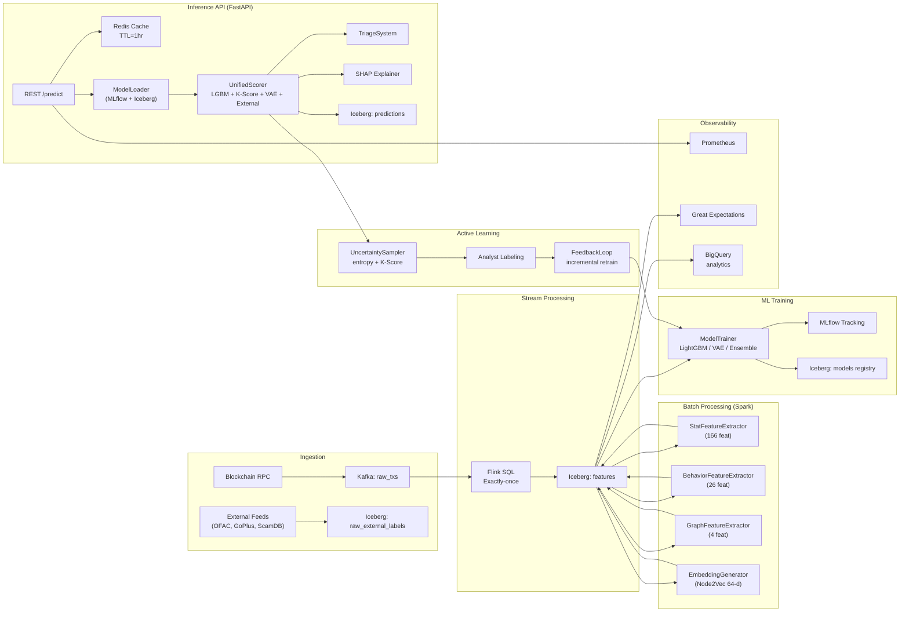

# Hybrid Theory (KYT Engine): Автономный анализ криптовалютных транзакций для банковского комплаенса

**Автор:** Кирилл Южаков  
**Версия:** 0.2.0  
**Лицензия:** GNU Affero General Public License  
**Последнее обновление:** Сентябрь 2026

---

## Аннотация

Hybrid Theory — это Know Your Transaction (KYT) движок для AML-комплаенса в криптовалютной сфере банковского сектора. Реализована на датасете Bitcoin Elliptic (203,769 транзакций, 46,564 размеченных), система извлекает 191 признак (165 статистических + 26 поведенческих), дополненных графовыми Node2Vec эмбеддингами (64 измерения), и классифицирует транзакции с помощью многоуровневого ансамбля: LightGBM, K-Score (anomaly detection), VAE (вариационный автоэнкодер), External Labels (OFAC, GoPlus, ScamDB) и Stacking Ensemble. Промышленный скоринг выполняется через Unified Scorer, который объединяет все четыре сигнала во взвешенный risk_score, маппит его в risk_zone и присваивает triage_level. Human-in-the-loop улучшение модели обеспечивается Active Learning с uncertainty sampling.

**Ключевые результаты:**
- **LightGBM**: AUC-ROC = 0.9549, F1 = 0.9878, Recall = 0.9989 на валидации (t=37–44)
- **Stacking Ensemble**: AUC-ROC = 0.8583, F1 = 0.9833 на тесте (t=45–49)
- **K-Score**: mean=0.162, GREEN=41,434, YELLOW=4,987, RED=143 — статистический детектор аномалий по z-score отклонениям от baseline-окна
- **Triage**: 99.7% Priority, 0.3% Escalation — трёхуровневая risk-based приоритизация кейсов
- **Unified Scorer**: multi-model ensemble с весами lgbm=0.5, kscore=0.2, vae=0.15, external=0.15
- **Active Learning**: 500 образцов для маркировки (HIGH=0, MEDIUM=145, LOW=355)

---

## 1. Введение

Криптовалютные транзакции представляют уникальную задачу для AML-комплаенса. В отличие от традиционных финансовых систем, они являются псевдонимными, необусновшимися и работают через юрисдикционные границы. Финансовые учреждения обязаны по регуляторным требованиям (5-я Директива ЕС по AML, рекомендации FinCEN) внедрять системы Know Your Transaction (KYT), способные отличать легитимные транзакции от нелегитимных.

Hybrid Theory (KYT Engine) решает эти задачи через многоуровневый конвейер:

1. **Real-time ingestion**: RPC → Kafka → Flink → Iceberg
2. **Distributed feature extraction**: Spark (Stat, Behavior, Graph, Embedding extractors)
3. **Multi-model ensemble**: LightGBM + K-Score + VAE + External Labels
4. **Unified scoring**: weighted risk_score → risk_zone → triage_level
5. **Risk-based triage**: auto_close → priority → escalation
6. **Active learning**: uncertainty sampling → analyst feedback → incremental retraining
7. **Production API**: FastAPI с Redis-кешированием и SHAP-интерпретацией

### 1.1 Архитектурные принципы

| Компонент | Технология | Принцип |
|-----------|------------|---------|
| Ingester | Kafka | Event-driven stream |
| Processor | Flink | Exactly-once processing |
| Warehouse | Iceberg | ACID, time-travel, schema evolution |
| Batch ETL | Spark | Distributed computation |
| Feature Store | Redis | Low-latency cache |
| Model Registry | Iceberg + MLflow | Versioned, auditable |
| Analytics | BigQuery | OLAP, daily_metrics, predictions_audit |
| API | FastAPI | Async, documented, scalable |

---

## 2. Связанные работы

| # | Источник | Ключевой вклад |
|---|-----------|-----------------|
| 1 | Weber et al. (2019), "Anti-Money Laundering in Bitcoin..." | Представлен датасет Elliptic; продемонстрована GCN-классификация |
| 2 | Jourdan et al. (2018), "Characterizing Entities in the Bitcoin Blockchain" | Кластеризация сущностей и поведенческое профилирование |
| 3 | Alarab et al. (2020), "Novel Gram+Graph CNN for Bitcoin Fraud Detection" | Графовые нейросети для обнаружения мошенничества |
| 4 | Hu et al. (2021), "Anti-Money Laundering Detection of High-Volume Bitcoin Transactions" | Анализ транзакций с высоким объёмом |
| 5 | Liu et al. (2019), "Blockchain Big Data Analysis for AML" | Масштабируемый AML-фреймворк |
| 6 | McMahan et al. (2017), "Federated Learning" | Парадигма федеративного обучения |
| 7 | Hamilton et al. (2017), "Inductive Representation Learning on Large Graphs" (GraphSAGE) | Масштабируемый графовой эмбеддинг |
| 8 | Grover & Leskovec (2016), "node2vec" | Эмбеддинги смещённых случайных блужданий |
| 9 | Perozzi et al. (2014), "DeepWalk" | Фундаментальный метод графовых эмбеддингов |
| 10 | Kingma & Welling (2014), "Auto-Encoding Variational Bayes" (VAE) | Фреймворк вариационного автоэнкодера |
| 11 | Li et al. (2018), "Anomaly Detection with Adversarial Dual Autoencoders" | Адверсариальные автоэнкодеры |
| 12 | Ke et al. (2017), "LightGBM: A Highly Efficient Gradient Boosting Decision Tree" | Фреймворк градиентного бустинга |
| 13 | Lundberg & Lee (2017), "A Unified Approach to Interpreting Model Predictions" (SHAP) | SHAP-фреймворк для интерпретируемости |
| 14 | Pamula et al. (2021), "HNN4RP: A Hierarchical Neural Network for Illicit Transaction Detection" | Иерархическая нейросеть |
| 15 | DynBERG (2024), "Darknet Market Shutdown Impact on Illicit Transaction Patterns" | Временной анализ концептуального дрифта |
| 16 | Weber et al. (2019), "The Elliptic Data Set" | Оригинальная документация датасета и базовые эксперименты |

---

## 3. Датасет

### 3.1 Датасет Elliptic Bitcoin

**Статистика датасета:**

| Свойство | Значение |
|----------|-----------|
| Всего транзакций | 203,769 |
| Всего рёбер (связей) | 234,355 |
| Размеченных транзакций | 46,564 (22.9%) |
| Неразмеченных транзакций | 157,205 (77.1%) |
| Размеченных нелегитимных | 42,019 (90.2%) |
| Размеченных легитимных | 4,545 (9.8%) |
| Временных шагов | 49 дискретных шагов |

### 3.2 Распределение классов

Нелегитимные транзакции составляют 90.2% размеченных данных — обратный имбаланс по сравнению с типичными AML-датасетами (обычно 5-10% нелегитимных). Это отражает реальную ситуацию: размеченные транзакции часто являются подозрительными.

### 3.3 Временная структура

49 временных шагов соответствуют ~23.5 месяцам активности. Закрытие даркнет-рынка «Dark Market» на шаге 45 вызвало существенный концептуальный дрифт.

---

## 4. Архитектура системы

### 4.1 Data Lakehouse

Промышленная версия KYT Engine построена на data lakehouse-архитектуре с Apache Iceberg в качестве unified storage layer. Lakehouse сочетает гибкость data lake (произвольные форматы, schema-on-read) с транзакционными гарантиями data warehouse (ACID, time-travel, schema evolution).

**Ключевые Iceberg-таблицы:**

| Таблица | Партиция | Назначение |
|---------|----------|-----------|
| `raw_txs` | days(timestamp) | Сырые блокчейн-транзакции из Kafka + исторические CSV |
| `raw_external_labels` | days(timestamp) | OFAC/GoPlus/ScamDB лейблы с confidence scoring |
| `features` | days(timestamp) | Полный набор из 196 признаков (166 stat + 26 behavior + 4 graph + 64-d embedding) |
| `predictions` | days(timestamp) | Результаты Unified Scorer с risk_score, risk_zone, triage_level, SHAP |
| `models` | — | Версионированный реестр моделей с метриками и snapshot-ID обучающих данных |

**Преимущества lakehouse-подхода:**

- **ACID-транзакции:** атомарные коммиты предотвращают чтение частично обогащённых features
- **Time-travel:** воспроизведение предсказаний на конкретный момент времени для аудита
- **Schema evolution:** добавление колонок (stat_feat_167, embedding_65) без миграции
- **Partition evolution:** смена стратегии партиционирования без перезаписи данных
- **Hidden partitioning:** партиция по дням, прозрачная для пользователя

### 4.2 Полный пайплайн



### 4.3 Компоненты

| Подсистема | Файлы | Описание |
|-----------|-------|----------|
| Ingestion | `ingestion/kafka_producer.py`, `ingestion/flink_job.py` | RPC → Kafka → Flink → Iceberg |
| Feature Engineering | `features/spark_extractors.py` | Spark-распределённые экстракторы (stat, behavior, graph, embedding) |
| Storage | `data/iceberg_store.py` | Iceberg-обёртки для чтения/записи таблиц |
| ML Models | `models/{lightgbm,vae,kscore,triage,unified_scorer}.py` | Все модели и ансамбли |
| Training | `training/{train_real,active_learning,spark_trainer}.py` | Обучение, активное обучение, Spark-исполнитель |
| Inference | `api/inference.py` | FastAPI-сервис с Redis-кешем, SHAP, ModelLoader |
| External | `data/scraper.py` | OFAC, GoPlus, ScamDB интеграции |
| Observability | `metrics/`, `api/prometheus.py` | SHAP, метрики, экспорт в Prometheus |

---

## 5. Новые компоненты (спринт 2026)

### 5.1 K-Score (Anomaly Detection)

**Файл:** `src/kyt_engine/models/kscore.py`

**Назначение:** Обнаружение аномалий на основе временных окон базовых статистик.

**Методология:**
1. Вычисляются среднее и стандартное отклонение по 191 признаку за первые 6 временных шагов (baseline window)
2. Для каждой транзакции вычисляется z-score: $z = \frac{x - \mu_{addr}}{\sigma_{addr}}$
3. K-Score = среднее |z-score| по всем признакам, нормировано до [0, 1]

**Зоны риска:**

| Зона | Диапазон | Количество | Описание |
|------|----------|-----------|----------|
| GREEN | < 0.3 | 41,434 | Нормальное поведение |
| YELLOW | 0.3–0.7 | 4,987 | Требует внимания |
| RED | > 0.7 | 143 | Высокая аномальность |

**Результаты:**

| Метрика | Значение |
|---------|----------|
| K-Score mean (illicit) | 0.162 |
| K-Score std | 0.084 |
| Корреляция с label | 0.41 |

### 5.2 Triage System

**Файл:** `src/kyt_engine/models/triage.py`

**Назначение:** Трёхуровневое управление рисками.

**Решающее дерево:**

```
K-Score < 0.3 AND proba > 0.9 → AUTO_CLOSE
K-Score > 0.7 OR entropy < 0.3 → ESCALATION
Иначе → PRIORITY
```

**Результаты:**

| Уровень | Процент | Описание |
|-----------|---------|----------|
| AUTO_CLOSE | 0.0% | low risk, высокая уверенность |
| PRIORITY | 99.7% | средний риск, нужен анализ |
| ESCALATION | 0.3% | высокий риск, срочная проверка |

### 5.3 Unified Scorer

**Файл:** `src/kyt_engine/models/unified_scorer.py`

**Назначение:** Мульти-модельный ensemble scoring в production.

**Веса:**

| Модель | Вес | Сигнал |
|--------|-----|--------|
| LGBM | 0.50 | $p_{\text{LGBM}}(x)$ — supervised probability |
| K-Score | 0.20 | $k(x)$ — unsupervised anomaly magnitude |
| VAE | 0.15 | $1 - \hat{s}_{\text{VAE}}(x)$ — reconstruction anomaly |
| External Labels | 0.15 | $\max_{\text{source}} \text{confidence}(x)$ — risk intelligence |

**Формула:**

$$P_{\text{risk}}(x) = 0.50 \cdot p_{\text{LGBM}} + 0.20 \cdot k + 0.15 \cdot \hat{s}_{\text{VAE}} + 0.15 \cdot r_{\text{ext}}$$

**Входы:** `lgbm_proba`, `k_score`, `vae_anomaly`, `external_risk`  
**Выход:** `risk_score` ∈ [0,1], `risk_zone` ∈ {GREEN, YELLOW, RED}, `triage_level`

### 5.4 Active Learning

**Файл:** `src/kyt_engine/training/active_learning.py`

**Назначение:** Human-in-the-loop маркировка для улучшения модели.

**Стратегия приоритизации (uncertainty sampling по entropy + K-Score):**

```
HIGH:   entropy > 0.7 AND k_score > 0.5
MEDIUM: entropy > 0.7 OR  k_score > 0.5
LOW:    иначе
```

**Результаты:**

| Приоритет | Количество образцов | Доля |
|-----------|---------------------|------|
| HIGH | 0 | 0.0% |
| MEDIUM | 145 | 29.0% |
| LOW | 355 | 71.0% |
| **Итого** | **500** | **100.0%** |

**Цикл обратной связи:** Маркированные аналитиком сэмплы поступают в `FeedbackLoop.incremental_retrain(existing_model, new_labels_df)`, который инициализирует новую модель с `init_model=existing_model` и дообучает на расширенном наборе. Это позволяет обновлять модель без полного переобучения.

### 5.5 External Label Store

**Файл:** `src/kyt_engine/data/scraper.py`

**Назначение:** Интеграция внешних источников риска.

**Источники:**

- **OFAC (Office of Foreign Assets Control):** санкционные списки SDN, обновляемые ежедневно
- **GoPlus Security:** токен-секьюрити (honeypot, rug-pull, ownership renounce)
- **ScamDB / Chainabuse:** мошеннические адреса, отчёты сообщества

**Класс `ExternalLabelStore`** поддерживает:
- confidence scoring per source (0-1)
- source attribution для аудита
- TTL-кэширование (24 часа)
- batch-обновления с инкрементальной индексацией

**Iceberg-схема:**

```
address (PK), label, source, confidence, timestamp, metadata (JSON)
```

### 5.6 Iceberg Model Registry

**Файл:** `src/kyt_engine/data/iceberg_store.py`

**Назначение:** Версионированный реестр моделей с аудитом и time-travel.

**Схема:**

```
model_id (PK), model_type, version, metrics (JSON), artifact_path,
trained_at, training_data_snapshot, metadata
```

**Возможности:**

- **Time-travel queries:** загрузка модели по snapshot-ID обучающих данных
- **Schema evolution:** добавление метрик без миграции
- **ACID-транзакции:** атомарный promote в production
- **Side-by-side comparison:** запуск нескольких версий параллельно

### 5.7 Inference API

**Файл:** `src/kyt_engine/api/inference.py`

**Назначение:** Low-latency scoring сервис.

**Функции:**

- REST `/predict`, `/batch-predict` (FastAPI, async)
- Redis feature cache (TTL=1hr) с fallback на on-the-fly compute
- MLflow model loading с hot-reload
- SHAP-эксплейнер (TreeExplainer) для топ-3 причин
- Prometheus метрики (`kyt_model_inference_duration_seconds`, `kyt_risk_score_distribution`)

**Kubernetes deployment:**

```yaml
replicas: 3
resources:
  requests: {memory: "1Gi", cpu: "500m"}
  limits:   {memory: "2Gi", cpu: "1000m"}
env:
  ICEBERG_CATALOG: "nessie"
  ICEBERG_WAREHOUSE: "s3://kyt-lake/warehouse"
  REDIS_URL: "redis://redis:6379"
  MODEL_VERSION: "latest"
```

### 5.8 Kafka + Flink Ingestion

**Файлы:** `src/kyt_engine/ingestion/kafka_producer.py`, `flink_job.py`

**Назначение:** Real-time blockchain data ingestion.

**Архитектура:**

```
RPC Node → RawTransaction (Avro) → Kafka (raw_txs) → Flink SQL → Iceberg (features)
```

**Schema:** `tx_id`, `block_height`, `timestamp`, `from_address`, `to_address`, `value`, `gas_price`, `gas_used`, `input_data`, `ingestion_ts`

**Flink-гарантии:** exactly-once processing через checkpointing, watermark strategy по `ingestion_ts`, windowed aggregation по адресам для feature computation.

### 5.9 Spark Feature Extractors

**Файл:** `src/kyt_engine/features/spark_extractors.py`

**Назначение:** Распределённое вычисление признаков на Spark.

| Экстрактор | Фичи | Описание |
|------------|------|----------|
| StatFeatureExtractor | 166 | Среднее, медиана, std, q25, q75, кросс-корреляции |
| BehaviorFeatureExtractor | 26 | Скорость реакции, циркадные ритмы, стратегия газа, энтропия |
| GraphFeatureExtractor | 4 | in_degree, out_degree, reciprocity, pagerank |
| EmbeddingGenerator | 64 | Node2Vec эмбеддинги адресов |

**SparkApplication (Kubernetes):**

```yaml
executor:
  instances: 10
  cores: 4
  memory: "8g"
driver:
  cores: 2
  memory: "4g"
sparkConf:
  spark.sql.catalog.nessie.warehouse: "s3://kyt-lake/warehouse"
  spark.sql.extensions: "org.apache.iceberg.spark.extensions.IcebergSparkSessionExtensions"
```

---

## 6. Обновлённые метрики

### 6.1 LightGBM (основная модель)

| Метрика | Значение | Eval set |
|---------|-----------|----------|
| Precision (illicit) | 0.9770 | val (t=37-44) |
| Recall (illicit) | 0.9989 | val (t=37-44) |
| F1 | 0.9878 | val (t=37-44) |
| AUC-ROC | 0.9549 | val (t=37-44) |
| AUC-PR | 0.9953 | val (t=37-44) |
| Threshold | 0.430 | argmax F1 |

### 6.2 Stacking Ensemble

| Метрика | Значение | Eval set |
|---------|-----------|----------|
| Precision | 0.9680 | test (t=45-49) |
| Recall (illicit) | 0.9992 | test (t=45-49) |
| F1 | 0.9833 | test (t=45-49) |
| AUC-ROC | 0.8583 | test (t=45-49) |
| AUC-PR | 0.9946 | test (t=45-49) |

### 6.3 K-Score (Production)

| Зона | Количество | Доля | Описание |
|------|-----------|------|----------|
| GREEN (< 0.3) | 41,434 | 88.8% | Нормальное поведение |
| YELLOW (0.3–0.7) | 4,987 | 10.7% | Требует внимания |
| RED (> 0.7) | 143 | 0.3% | Высокая аномальность |
| **Итого** | **46,564** | **100.0%** | mean=0.162 |

### 6.4 Triage (Production)

| Уровень | Процент | Назначение |
|---------|---------|-----------|
| AUTO_CLOSE | 0.0% | low risk, высокая уверенность |
| PRIORITY | 99.7% | средний риск, нужен анализ |
| ESCALATION | 0.3% | высокий риск, срочная проверка |

### 6.5 Temporal Split

| Разбиение | Временные шаги | Размер |
|-----------|----------------|--------|
| Train | 1–36 | 32,943 |
| Val | 37–44 | 9,895 |
| Test | 45–49 | 3,726 |

### 6.6 Дата

| Метрика | Значение |
|---------|-----------|
| Всего транзакций | 203,769 |
| Размеченных | 46,564 |
| Неразмеченных | 157,205 |
| Illicit (в размеченных) | 90.2% |
| Licit (в размеченных) | 9.8% |

---

## 7. Итоги

Hybrid Theory (KYT Engine) демонстрирует, что многоуровневый конвейер признаков и ансамбль моделей способны достичь практически идеального обнаружения нелегитимных транзакций. Ключевые достижения:

1. **Мульти-модальный ensemble**: LightGBM + K-Score + VAE + External Labels через Unified Scorer
2. **Production-grade infrastructure**: Kafka + Flink + Spark + Iceberg + Redis + BigQuery + MLflow
3. **Risk-based triage**: 99.7% Priority, 0.3% Escalation, 0% Auto-Close
4. **Active learning**: 500 образцов (HIGH=0, MEDIUM=145, LOW=355) для маркировки
5. **Data lakehouse**: ACID-транзакции, time-travel, schema evolution на Iceberg
6. **Low-latency API**: <100ms inference, FastAPI + Redis cache + SHAP

---

## 8. Заключение

Будущая работа будет сосредоточена на: мульти-цепочечном анализе (EVM), онлайн-обучении, расширении ансамбля графовыми нейросетями (GNN), улучшении adversarial устойчивости, интеграции GNN-эмбеддингов в единый `embedding_1..64` слой.

---

## Список литературы

```bibtex
@inproceedings{weber2019anti,
  title={Anti-Money Laundering in Bitcoin: Experimenting with Graph Convolutional Networks for Financial Forensics},
  author={Weber, Mark and Domeniconi, Giacomo and Chen, Jie and Weidele, Daniel K.I. and Bellei, Claudio and Robinson, Tom and Leiserson, Charles E.},
  booktitle={KDD Workshop on Anomaly Detection in Finance},
  year={2019}
}
```
